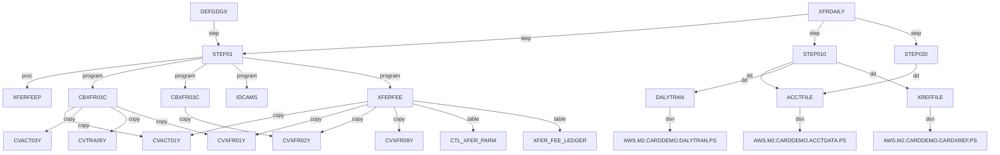

# Chain graph

### xferfee

## Edges

| From | Relationship | To |
|---|---|---|
| ACCTDATA | dsn | AWS.M2.CARDDEMO.ACCTDATA.PS |
| ACCTFILE | dsn | AWS.M2.CARDDEMO.ACCTDATA.PS |
| ACCTFILE | dsn | AWS.M2.CARDDEMO.ACCTDATA.VSAM.KSDS |
| ACCTFILE | step | STEP05 |
| ACCTFILE | step | STEP10 |
| ACCTFILE | step | STEP15 |
| ACCTOUT | dsn | AWS.M2.CARDDEMO.ACCTDATA.IMPORT |
| ACCTOUT | dsn | AWS.M2.CARDDEMO.ACCTDATA.XFER(+1) |
| ACCTVSAM | dsn | AWS.M2.CARDDEMO.ACCTDATA.VSAM.KSDS |
| ARRYFILE | dsn | AWS.M2.CARDDEMO.ACCTDATA.ARRYPS |
| CARDDATA | dsn | AWS.M2.CARDDEMO.CARDDATA.PS |
| CARDFILE | dsn | AWS.M2.CARDDEMO.CARDDATA.VSAM.KSDS |
| CARDFILE | step | CLCIFIL |
| CARDFILE | step | OPCIFIL |
| CARDFILE | step | STEP05 |
| CARDFILE | step | STEP10 |
| CARDFILE | step | STEP15 |
| CARDFILE | step | STEP40 |
| CARDFILE | step | STEP50 |
| CARDFILE | step | STEP60 |
| CARDVSAM | dsn | AWS.M2.CARDDEMO.CARDDATA.VSAM.KSDS |
| CARDXREF | dsn | AWS.M2.CARDDEMO.CARDXREF.VSAM.KSDS |
| CBACT01C | copy | CODATECN |
| CBACT01C | copy | CVACT01Y |
| CBACT01C | copy | OF |
| CBACT02C | copy | CVACT02Y |
| CBACT03C | copy | CVACT03Y |
| CBACT04C | copy | CVACT01Y |
| CBACT04C | copy | CVACT03Y |
| CBACT04C | copy | CVTRA01Y |
| CBACT04C | copy | CVTRA02Y |
| CBACT04C | copy | CVTRA05Y |
| CBADMCDJ | step | STEP1 |
| CBCUS01C | copy | CVCUS01Y |
| CBEXPORT | copy | CVACT01Y |
| CBEXPORT | copy | CVACT02Y |
| CBEXPORT | copy | CVACT03Y |
| CBEXPORT | copy | CVCUS01Y |
| CBEXPORT | copy | CVEXPORT |
| CBEXPORT | copy | CVTRA05Y |
| CBEXPORT | step | STEP01 |
| CBEXPORT | step | STEP02 |
| CBIMPORT | copy | CVACT01Y |
| CBIMPORT | copy | CVACT02Y |
| CBIMPORT | copy | CVACT03Y |
| CBIMPORT | copy | CVCUS01Y |
| CBIMPORT | copy | CVEXPORT |
| CBIMPORT | copy | CVTRA05Y |
| CBIMPORT | step | STEP01 |
| CBPAUP0J | step | STEP01 |
| CBSTM03A | copy | COSTM01 |
| CBSTM03A | copy | CUSTREC |
| CBSTM03A | copy | CVACT01Y |
| CBSTM03A | copy | CVACT03Y |
| CBTRN02C | copy | CVACT01Y |
| CBTRN02C | copy | CVACT03Y |
| CBTRN02C | copy | CVTRA01Y |
| CBTRN02C | copy | CVTRA05Y |
| CBTRN02C | copy | CVTRA06Y |
| CBTRN03C | copy | CVACT03Y |
| CBTRN03C | copy | CVTRA03Y |
| CBTRN03C | copy | CVTRA04Y |
| CBTRN03C | copy | CVTRA05Y |
| CBTRN03C | copy | CVTRA07Y |
| CBXFR01C | copy | CVACT01Y |
| CBXFR01C | copy | CVACT03Y |
| CBXFR01C | copy | CVTRA05Y |
| CBXFR01C | copy | CVXFR01Y |
| CBXFR03C | copy | CVXFR02Y |
| CLCIFIL | program | SDSF |
| CLOSEFIL | step | CLCIFIL |
| COMBTRAN | step | STEP05R |
| COMBTRAN | step | STEP10 |
| CRCRDDB | dd | STEPLIB |
| CRCRDDB | dd | SYSIN |
| CRCRDDB | dd | SYSTSIN |
| CRCRDDB | program | IKJEFT01 |
| CREADB2 | step | CRCRDDB |
| CREADB2 | step | FREEPLN |
| CREADB2 | step | LDTCCAT |
| CREADB2 | step | LDTTYPE |
| CREADB2 | step | RUNTEP2 |
| CREASTMT | step | DELDEF01 |
| CREASTMT | step | STEP010 |
| CREASTMT | step | STEP020 |
| CREASTMT | step | STEP030 |
| CREASTMT | step | STEP040 |
| CUSTDATA | dsn | AWS.M2.CARDDEMO.CUSTDATA.PS |
| CUSTFILE | dsn | AWS.M2.CARDDEMO.CUSTDATA.VSAM.KSDS |
| CUSTFILE | step | CLCIFIL |
| CUSTFILE | step | OPCIFIL |
| CUSTFILE | step | STEP05 |
| CUSTFILE | step | STEP10 |
| CUSTFILE | step | STEP15 |
| CUSTOUT | dsn | AWS.M2.CARDDEMO.CUSTDATA.IMPORT |
| CUSTVSAM | dsn | AWS.M2.CARDDEMO.CUSTDATA.VSAM.KSDS |
| DALYREJS | dsn | AWS.M2.CARDDEMO.DALYREJS(+1) |
| DALYREJS | step | STEP05 |
| DALYTRAN | dsn | AWS.M2.CARDDEMO.DALYTRAN.PS |
| DATEPARM | dsn | AWS.M2.CARDDEMO.DATEPARM |
| DBPAUTP0 | step | STEPDEL |
| DBPAUTP0 | step | UNLOAD |
| DBRMLIB | dsn | AWS.M2.CARDDEMO.DBRMLIB |
| DD01 | dsn | &HLQ..TRANTYPE.PS |
| DD01 | dsn | AWS.M2.CARDDEMO.ACCTDATA.PSCOMP |
| DD01 | dsn | AWS.M2.CARDDEMO.ESDSRRDS.PS |
| DD01 | dsn | AWS.M2.CARDDEMO.USRSEC.PS |
| DD02 | dsn | &HLQ..TRANCATG.PS |
| DD02 | dsn | AWS.M2.CARDDEMO.ACCTDATA.ARRYPS |
| DD03 | dsn | AWS.M2.CARDDEMO.ACCTDATA.VBPS |
| DD1 | dsn | AWS.M2.CARDDEMO.PAUTDB.ROOT.FILEO |
| DD2 | dsn | AWS.M2.CARDDEMO.PAUTDB.CHILD.FILEO |
| DDPAUTP0 | dsn | OEM.IMS.IMSP.PAUTHDB |
| DDPAUTX0 | dsn | OEM.IMS.IMSP.PAUTHDBX |
| DEFCUST | step | STEP05 |
| DEFGDGB | step | STEP05 |
| DEFGDGD | step | STEP10 |
| DEFGDGD | step | STEP20 |
| DEFGDGD | step | STEP30 |
| DEFGDGD | step | STEP40 |
| DEFGDGD | step | STEP50 |
| DEFGDGD | step | STEP60 |
| DEFGDGX | step | STEP01 |
| DELDEF | dd | THEFILE |
| DELDEF | program | IEFBR14 |
| DELDEF01 | program | IDCAMS |
| DFHCSD | dsn | OEM.CICSTS.DFHCSD |
| DFSRESLB | dsn | IMS.SDFSRESL |
| DFSRESLB | dsn | OEMA.IMS.IMSP.SDFSRESL |
| DFSSEL | dsn | IMS.SDFSRESL |
| DFSURGU1 | dsn | AWS.M2.CARDDEMO.IMSDATA.DBPAUTP0 |
| DFSVSAMP | dsn | OEMPP.IMS.V15R01MB.PROCLIB(DFSVSMDB) |
| DISCGRP | dsn | AWS.M2.CARDDEMO.DISCGRP.PS |
| DISCGRP | dsn | AWS.M2.CARDDEMO.DISCGRP.VSAM.KSDS |
| DISCGRP | step | STEP05 |
| DISCGRP | step | STEP10 |
| DISCGRP | step | STEP15 |
| DISCVSAM | dsn | AWS.M2.CARDDEMO.DISCGRP.VSAM.KSDS |
| DUSRSECJ | step | PREDEL |
| DUSRSECJ | step | STEP01 |
| DUSRSECJ | step | STEP02 |
| DUSRSECJ | step | STEP03 |
| ERROUT | dsn | AWS.M2.CARDDEMO.IMPORT.ERRORS |
| ESDSRRDS | step | PREDEL |
| ESDSRRDS | step | STEP01 |
| ESDSRRDS | step | STEP02 |
| ESDSRRDS | step | STEP03 |
| ESDSRRDS | step | STEP04 |
| ESDSRRDS | step | STEP05 |
| EXPFILE | dsn | AWS.M2.CARDDEMO.EXPORT.DATA |
| FILEIN | dsn | AWS.M2.CARDDEMO.TCATBALF.VSAM.KSDS |
| FILEIN | dsn | AWS.M2.CARDDEMO.TRANSACT.VSAM.KSDS |
| FILEOUT | dsn | AWS.M2.CARDDEMO.TCATBALF.BKUP(+1) |
| FILEOUT | dsn | AWS.M2.CARDDEMO.TRANSACT.BKUP(+1) |
| FREEPLN | dd | STEPLIB |
| FREEPLN | dd | SYSTSIN |
| FREEPLN | program | IKJEFT01 |
| FTPJCLS | step | STEP1 |
| HTMLFILE | dsn | AWS.M2.CARDDEMO.STATEMNT.HTML |
| IDCAMS | dd | IN |
| IDCAMS | dd | OUT |
| IDCAMS | program | IDCAMS |
| IMS | dsn | IMS.DBDLIB |
| IMS | dsn | IMS.PSBLIB |
| IMS | dsn | OEM.IMS.IMSP.DBDLIB |
| IMS | dsn | OEM.IMS.IMSP.PSBLIB |
| IN | dsn | AWS.M2.CARDDEMO.ESDSRRDS.PS |
| IN | dsn | AWS.M2.CARDDEMO.USRSEC.PS |
| IN | dsn | AWS.M2.CARDEMO.FTP.TEST |
| IN | dsn | AWS.M2.CARDEMO.FTP.TEST.BKUP |
| INDD | dsn | AWS.M2.CARDDEMO.STATEMNT.PS |
| INFILE | dsn | AWS.M2.CARDDEMO.TRXFL.SEQ |
| INFILE1 | dsn | AWS.M2.CARDDEMO.PAUTDB.ROOT.FILEO |
| INFILE2 | dsn | AWS.M2.CARDDEMO.PAUTDB.CHILD.FILEO |
| INPFILE | dsn | INPFILE |
| INTCALC | step | STEP15 |
| INTRDRJ1 | step | IDCAMS |
| INTRDRJ1 | step | STEP01 |
| INTRDRJ2 | step | IDCAMS |
| LDTCCAT | dd | STEPLIB |
| LDTCCAT | dd | SYSIN |
| LDTCCAT | dd | SYSTSIN |
| LDTCCAT | program | IKJEFT01 |
| LDTTYPE | program | IEFBR14 |
| LOADPADB | step | STEP01 |
| MNTTRDB2 | step | STEP1 |
| OLD1 | dsn | AWS.M2.CARDDEMO.XFER.FEES(-1) |
| OLD2 | dsn | AWS.M2.CARDDEMO.XFER.FEES(-2) |
| OPCIFIL | program | SDSF |
| OPENFIL | step | OPCIFIL |
| OUT | dsn | AWS.M2.CARDDEMO.USRSEC.VSAM.ESDS |
| OUT | dsn | AWS.M2.CARDDEMO.USRSEC.VSAM.KSDS |
| OUT | dsn | AWS.M2.CARDDEMO.USRSEC.VSAM.RRDS |
| OUT | dsn | AWS.M2.CARDEMO.FTP.TEST.BKUP |
| OUT | dsn | AWS.M2.CARDEMO.FTP.TEST.BKUP.INTRDR |
| OUTFIL1 | dsn | AWS.M2.CARDDEMO.PAUTDB.ROOT.FILEO |
| OUTFIL2 | dsn | AWS.M2.CARDDEMO.PAUTDB.CHILD.FILEO |
| OUTFILE | dsn | AWS.M2.CARDDEMO.ACCTDATA.PSCOMP |
| OUTFILE | dsn | AWS.M2.CARDDEMO.TRXFL.VSAM.KSDS |
| PADFILOP | dsn | AWS.M2.CARDDEMO.PAUTDB.CHILD.GSAM |
| PASFILOP | dsn | AWS.M2.CARDDEMO.PAUTDB.ROOT.GSAM |
| POSTTRAN | step | STEP15 |
| PRC001 | dd | FILEIN |
| PRC001 | dd | FILEOUT |
| PREDEL | dd | DD01 |
| PREDEL | dd | DD02 |
| PREDEL | dd | DD03 |
| PREDEL | program | IEFBR14 |
| PROCLIB | dsn | IMS.PROCLIB |
| PRTCATBL | step | DELDEF |
| PRTCATBL | step | PRC001 |
| PRTCATBL | step | STEP05R |
| PRTCATBL | step | STEP10R |
| READACCT | step | PREDEL |
| READACCT | step | STEP05 |
| READCARD | step | STEP05 |
| READCUST | step | STEP05 |
| READXREF | step | STEP05 |
| RECON1 | dsn | OEM.IMS.IMSP.RECON1 |
| RECON2 | dsn | OEM.IMS.IMSP.RECON2 |
| RECON3 | dsn | OEM.IMS.IMSP.RECON3 |
| REPTFILE | step | STEP05 |
| RUNTEP2 | dd | STEPLIB |
| RUNTEP2 | dd | SYSIN |
| RUNTEP2 | dd | SYSTSIN |
| RUNTEP2 | program | IKJEFT01 |
| SORTIN | dsn | AWS.M2.CARDDEMO.SYSTRAN(0) |
| SORTIN | dsn | AWS.M2.CARDDEMO.TCATBALF.BKUP(+1) |
| SORTIN | dsn | AWS.M2.CARDDEMO.TRANSACT.BKUP(+1) |
| SORTIN | dsn | AWS.M2.CARDDEMO.TRANSACT.BKUP(0) |
| SORTIN | dsn | AWS.M2.CARDDEMO.TRANSACT.VSAM.KSDS |
| SORTOUT | dsn | AWS.M2.CARDDEMO.TCATBALF.REPT |
| SORTOUT | dsn | AWS.M2.CARDDEMO.TRANSACT.COMBINED(+1) |
| SORTOUT | dsn | AWS.M2.CARDDEMO.TRANSACT.DALY(+1) |
| SORTOUT | dsn | AWS.M2.CARDDEMO.TRXFL.SEQ |
| STEP0 | dd | DD1 |
| STEP0 | dd | DD2 |
| STEP0 | program | IEFBR14 |
| STEP01 | dd | ACCTOUT |
| STEP01 | dd | CUSTOUT |
| STEP01 | dd | DDPAUTP0 |
| STEP01 | dd | DDPAUTX0 |
| STEP01 | dd | DFSRESLB |
| STEP01 | dd | DFSSEL |
| STEP01 | dd | DFSVSAMP |
| STEP01 | dd | ERROUT |
| STEP01 | dd | EXPFILE |
| STEP01 | dd | IMS |
| STEP01 | dd | INFILE1 |
| STEP01 | dd | INFILE2 |
| STEP01 | dd | OLD1 |
| STEP01 | dd | OLD2 |
| STEP01 | dd | OUTFIL1 |
| STEP01 | dd | OUTFIL2 |
| STEP01 | dd | PADFILOP |
| STEP01 | dd | PASFILOP |
| STEP01 | dd | PROCLIB |
| STEP01 | dd | STEPLIB |
| STEP01 | dd | SYSUT1 |
| STEP01 | dd | SYSUT2 |
| STEP01 | dd | TRNXOUT |
| STEP01 | dd | XREFOUT |
| STEP01 | proc | XFERFEEP |
| STEP01 | program | CBIMPORT |
| STEP01 | program | CBXFR01C |
| STEP01 | program | CBXFR03C |
| STEP01 | program | DFSRRC00 |
| STEP01 | program | IDCAMS |
| STEP01 | program | IEBGENER |
| STEP01 | program | IEFBR14 |
| STEP01 | program | XFERFEE |
| STEP010 | dd | ACCTFILE |
| STEP010 | dd | DALYTRAN |
| STEP010 | dd | SORTIN |
| STEP010 | dd | SORTOUT |
| STEP010 | dd | STEPLIB |
| STEP010 | dd | XFEREXTR |
| STEP010 | dd | XREFFILE |
| STEP010 | program | CBXFR01C |
| STEP010 | program | SORT |
| STEP02 | dd | ACCTFILE |
| STEP02 | dd | CARDFILE |
| STEP02 | dd | CUSTFILE |
| STEP02 | dd | EXPFILE |
| STEP02 | dd | STEPLIB |
| STEP02 | dd | TRANSACT |
| STEP02 | dd | XREFFILE |
| STEP02 | program | CBEXPORT |
| STEP02 | program | IDCAMS |
| STEP020 | dd | ACCTFILE |
| STEP020 | dd | ACCTOUT |
| STEP020 | dd | INFILE |
| STEP020 | dd | OUTFILE |
| STEP020 | dd | STEPLIB |
| STEP020 | dd | XFEREXTR |
| STEP020 | dd | XFERFEE |
| STEP020 | program | IDCAMS |
| STEP020 | program | XFERFEE |
| STEP03 | dd | IN |
| STEP03 | dd | OUT |
| STEP03 | program | IDCAMS |
| STEP030 | dd | HTMLFILE |
| STEP030 | dd | STEPLIB |
| STEP030 | dd | STMTFILE |
| STEP030 | dd | XFERFEE |
| STEP030 | dd | XFERRPT |
| STEP030 | program | CBXFR03C |
| STEP030 | program | IEFBR14 |
| STEP04 | program | IDCAMS |
| STEP040 | dd | ACCTFILE |
| STEP040 | dd | CUSTFILE |
| STEP040 | dd | HTMLFILE |
| STEP040 | dd | STEPLIB |
| STEP040 | dd | STMTFILE |
| STEP040 | dd | TRNXFILE |
| STEP040 | dd | XREFFILE |
| STEP040 | program | CBSTM03A |
| STEP05 | dd | ACCTFILE |
| STEP05 | dd | ARRYFILE |
| STEP05 | dd | CARDFILE |
| STEP05 | dd | CUSTFILE |
| STEP05 | dd | IN |
| STEP05 | dd | OUT |
| STEP05 | dd | OUTFILE |
| STEP05 | dd | STEPLIB |
| STEP05 | dd | VBRCFILE |
| STEP05 | dd | XREFFILE |
| STEP05 | program | CBACT01C |
| STEP05 | program | CBACT02C |
| STEP05 | program | CBACT03C |
| STEP05 | program | CBCUS01C |
| STEP05 | program | IDCAMS |
| STEP05R | dd | SORTIN |
| STEP05R | dd | SORTOUT |
| STEP05R | proc | REPROC |
| STEP05R | program | IDCAMS |
| STEP05R | program | SORT |
| STEP1 | dd | DBRMLIB |
| STEP1 | dd | DFHCSD |
| STEP1 | dd | INPFILE |
| STEP1 | dd | STEPLIB |
| STEP1 | program | DFHCSDUP |
| STEP1 | program | FTP |
| STEP1 | program | IKJEFT01 |
| STEP10 | dd | SYSUT1 |
| STEP10 | dd | SYSUT2 |
| STEP10 | dd | TRANSACT |
| STEP10 | dd | TRANVSAM |
| STEP10 | program | IDCAMS |
| STEP10 | program | IEBGENER |
| STEP10R | dd | CARDXREF |
| STEP10R | dd | DATEPARM |
| STEP10R | dd | SORTIN |
| STEP10R | dd | SORTOUT |
| STEP10R | dd | STEPLIB |
| STEP10R | dd | TRANCATG |
| STEP10R | dd | TRANFILE |
| STEP10R | dd | TRANREPT |
| STEP10R | dd | TRANTYPE |
| STEP10R | program | CBTRN03C |
| STEP10R | program | SORT |
| STEP15 | dd | ACCTDATA |
| STEP15 | dd | ACCTFILE |
| STEP15 | dd | ACCTVSAM |
| STEP15 | dd | CARDDATA |
| STEP15 | dd | CARDVSAM |
| STEP15 | dd | CUSTDATA |
| STEP15 | dd | CUSTVSAM |
| STEP15 | dd | DALYREJS |
| STEP15 | dd | DALYTRAN |
| STEP15 | dd | DISCGRP |
| STEP15 | dd | DISCVSAM |
| STEP15 | dd | STEPLIB |
| STEP15 | dd | TCATBAL |
| STEP15 | dd | TCATBALF |
| STEP15 | dd | TCATBALV |
| STEP15 | dd | TCATVSAM |
| STEP15 | dd | TRANCATG |
| STEP15 | dd | TRANFILE |
| STEP15 | dd | TRANSACT |
| STEP15 | dd | TRANTYPE |
| STEP15 | dd | TRANVSAM |
| STEP15 | dd | TTYPVSAM |
| STEP15 | dd | XREFDATA |
| STEP15 | dd | XREFFIL1 |
| STEP15 | dd | XREFFILE |
| STEP15 | dd | XREFVSAM |
| STEP15 | program | CBACT04C |
| STEP15 | program | CBTRN02C |
| STEP15 | program | IDCAMS |
| STEP20 | dd | SYSUT1 |
| STEP20 | dd | SYSUT2 |
| STEP20 | program | IDCAMS |
| STEP20 | program | IEBGENER |
| STEP25 | program | IDCAMS |
| STEP30 | dd | DD01 |
| STEP30 | dd | DD02 |
| STEP30 | program | IDCAMS |
| STEP30 | program | IEFBR14 |
| STEP40 | dd | STEPLIB |
| STEP40 | dd | SYSREC00 |
| STEP40 | dd | SYSUT1 |
| STEP40 | dd | SYSUT2 |
| STEP40 | program | IDCAMS |
| STEP40 | program | IEBGENER |
| STEP40 | program | IKJEFT01 |
| STEP50 | dd | STEPLIB |
| STEP50 | dd | SYSREC00 |
| STEP50 | program | IDCAMS |
| STEP50 | program | IKJEFT01 |
| STEP60 | dd | SYSUT1 |
| STEP60 | dd | SYSUT2 |
| STEP60 | program | IDCAMS |
| STEP60 | program | IEBGENER |
| STEPDEL | dd | SYSUT1 |
| STEPDEL | program | IEFBR14 |
| STEPLIB | dsn | AWS.M2.CARDDEMO.LOADLIB |
| STEPLIB | dsn | AWS.M2.LBD.TXT2PDF.LOAD |
| STEPLIB | dsn | IMS.SDFSRESL |
| STEPLIB | dsn | OEM.CICSTS.V05R06M0.CICS.SDFHLOAD |
| STEPLIB | dsn | OEM.DB2.&DB2S..RUNLIB.LOAD |
| STEPLIB | dsn | OEM.DB2.DAZ1.RUNLIB.LOAD |
| STEPLIB | dsn | OEM.DB2.DAZ1.SDSNEXIT |
| STEPLIB | dsn | OEMA.DB2.VERSIONA.SDSNLOAD |
| STEPLIB | dsn | OEMA.IMS.IMSP.SDFSRESL |
| STEPLIB | dsn | OEMA.IMS.IMSP.SDFSRESL.V151 |
| STEPLIB | dsn | XXXXXXXX.PROD.LOADLIB |
| STMTFILE | dsn | AWS.M2.CARDDEMO.STATEMNT.PS |
| SYSEXEC | dsn | AWS.M2.LBD.TXT2PDF.EXEC |
| SYSIN | dsn | &LBNM..CNTL(DB2CREAT) |
| SYSIN | dsn | &LBNM..CNTL(DB2LTCAT) |
| SYSIN | dsn | &LBNM..CNTL(DB2LTTYP) |
| SYSREC00 | dsn | &HLQ..TRANCATG.PS |
| SYSREC00 | dsn | &HLQ..TRANTYPE.PS |
| SYSTSIN | dsn | &LBNM..CNTL(DB2FREE) |
| SYSTSIN | dsn | &LBNM..CNTL(DB2TEP41) |
| SYSTSIN | dsn | &LBNM..CNTL(DB2TIAD1) |
| SYSUT1 | dsn | &HLQ..TRANCATG.PS |
| SYSUT1 | dsn | &HLQ..TRANTYPE.PS |
| SYSUT1 | dsn | AWS.M2.CARDDEMO.DISCGRP.PS |
| SYSUT1 | dsn | AWS.M2.CARDDEMO.IMSDATA.DBPAUTP0 |
| SYSUT1 | dsn | AWS.M2.CARDDEMO.JCL(INTRDRJ2) |
| SYSUT1 | dsn | AWS.M2.CARDDEMO.TRANCATG.PS |
| SYSUT1 | dsn | AWS.M2.CARDDEMO.TRANTYPE.PS |
| SYSUT2 | dsn | &HLQ..TRANCATG.PS.BKUP(+1) |
| SYSUT2 | dsn | &HLQ..TRANTYPE.BKUP(+1) |
| SYSUT2 | dsn | AWS.M2.CARDDEMO.DISCGRP.BKUP(+1) |
| SYSUT2 | dsn | AWS.M2.CARDDEMO.ESDSRRDS.PS |
| SYSUT2 | dsn | AWS.M2.CARDDEMO.TRANCATG.PS.BKUP(+1) |
| SYSUT2 | dsn | AWS.M2.CARDDEMO.TRANTYPE.BKUP(+1) |
| SYSUT2 | dsn | AWS.M2.CARDDEMO.USRSEC.PS |
| TCATBAL | dsn | AWS.M2.CARDDEMO.TCATBALF.PS |
| TCATBALF | dsn | AWS.M2.CARDDEMO.TCATBALF.VSAM.KSDS |
| TCATBALF | step | STEP05 |
| TCATBALF | step | STEP10 |
| TCATBALF | step | STEP15 |
| TCATBALV | dsn | AWS.M2.CARDDEMO.TCATBALF.VSAM.KSDS |
| TCATVSAM | dsn | AWS.M2.CARDDEMO.TRANCATG.VSAM.KSDS |
| THEFILE | dsn | AWS.M2.CARDDEMO.TCATBALF.REPT |
| TRANBKP | step | PRC001 |
| TRANBKP | step | STEP05 |
| TRANBKP | step | STEP05R |
| TRANBKP | step | STEP10 |
| TRANCATG | dsn | AWS.M2.CARDDEMO.TRANCATG.PS |
| TRANCATG | dsn | AWS.M2.CARDDEMO.TRANCATG.VSAM.KSDS |
| TRANCATG | step | STEP05 |
| TRANCATG | step | STEP10 |
| TRANCATG | step | STEP15 |
| TRANEXTR | step | STEP10 |
| TRANEXTR | step | STEP20 |
| TRANEXTR | step | STEP30 |
| TRANEXTR | step | STEP40 |
| TRANEXTR | step | STEP50 |
| TRANFILE | dsn | AWS.M2.CARDDEMO.TRANSACT.DALY(+1) |
| TRANFILE | dsn | AWS.M2.CARDDEMO.TRANSACT.VSAM.KSDS |
| TRANFILE | step | CLCIFIL |
| TRANFILE | step | OPCIFIL |
| TRANFILE | step | STEP05 |
| TRANFILE | step | STEP10 |
| TRANFILE | step | STEP15 |
| TRANFILE | step | STEP20 |
| TRANFILE | step | STEP25 |
| TRANFILE | step | STEP30 |
| TRANIDX | step | STEP20 |
| TRANIDX | step | STEP25 |
| TRANIDX | step | STEP30 |
| TRANREPT | dsn | AWS.M2.CARDDEMO.TRANREPT(+1) |
| TRANREPT | step | PRC001 |
| TRANREPT | step | STEP05R |
| TRANREPT | step | STEP10R |
| TRANSACT | dsn | AWS.M2.CARDDEMO.DALYTRAN.PS.INIT |
| TRANSACT | dsn | AWS.M2.CARDDEMO.SYSTRAN(+1) |
| TRANSACT | dsn | AWS.M2.CARDDEMO.TRANSACT.COMBINED(+1) |
| TRANSACT | dsn | AWS.M2.CARDDEMO.TRANSACT.VSAM.KSDS |
| TRANTYPE | dsn | AWS.M2.CARDDEMO.TRANTYPE.PS |
| TRANTYPE | dsn | AWS.M2.CARDDEMO.TRANTYPE.VSAM.KSDS |
| TRANTYPE | step | STEP05 |
| TRANTYPE | step | STEP10 |
| TRANTYPE | step | STEP15 |
| TRANVSAM | dsn | AWS.M2.CARDDEMO.TRANSACT.VSAM.KSDS |
| TRNXFILE | dsn | AWS.M2.CARDDEMO.TRXFL.VSAM.KSDS |
| TRNXOUT | dsn | AWS.M2.CARDDEMO.TRANSACT.IMPORT |
| TTYPVSAM | dsn | AWS.M2.CARDDEMO.TRANTYPE.VSAM.KSDS |
| TXT2PDF | dd | INDD |
| TXT2PDF | dd | STEPLIB |
| TXT2PDF | dd | SYSEXEC |
| TXT2PDF | program | IKJEFT1B |
| TXT2PDF1 | step | TXT2PDF |
| UNLDGSAM | step | STEP01 |
| UNLDPADB | step | STEP0 |
| UNLDPADB | step | STEP01 |
| UNLOAD | dd | DDPAUTP0 |
| UNLOAD | dd | DDPAUTX0 |
| UNLOAD | dd | DFSRESLB |
| UNLOAD | dd | DFSURGU1 |
| UNLOAD | dd | DFSVSAMP |
| UNLOAD | dd | IMS |
| UNLOAD | dd | RECON1 |
| UNLOAD | dd | RECON2 |
| UNLOAD | dd | RECON3 |
| UNLOAD | dd | STEPLIB |
| UNLOAD | program | DFSRRC00 |
| VBRCFILE | dsn | AWS.M2.CARDDEMO.ACCTDATA.VBPS |
| WAIT | dd | STEPLIB |
| WAIT | program | COBSWAIT |
| WAITSTEP | step | WAIT |
| XFEREXTR | dsn | AWS.M2.CARDDEMO.XFER.EXTRACT(+1) |
| XFEREXTR | dsn | AWS.M2.CARDDEMO.XFER.EXTRACT(0) |
| XFERFEE | copy | CVACT01Y |
| XFERFEE | copy | CVXFR01Y |
| XFERFEE | copy | CVXFR02Y |
| XFERFEE | copy | CVXFR09Y |
| XFERFEE | dsn | AWS.M2.CARDDEMO.XFER.FEES(+1) |
| XFERFEE | dsn | AWS.M2.CARDDEMO.XFER.FEES(0) |
| XFERFEE | step | STEP020 |
| XFERFEE | table | CTL_XFER_PARM |
| XFERFEE | table | XFER_FEE_LEDGER |
| XFERRPT | dsn | AWS.M2.CARDDEMO.XFER.RECON.RPT(+1) |
| XFRDAILY | step | STEP01 |
| XFRDAILY | step | STEP010 |
| XFRDAILY | step | STEP020 |
| XFREXTR | step | STEP010 |
| XFRPURGE | step | STEP01 |
| XFRRECON | step | STEP030 |
| XREFDATA | dsn | AWS.M2.CARDDEMO.CARDXREF.PS |
| XREFFIL1 | dsn | AWS.M2.CARDDEMO.CARDXREF.VSAM.AIX.PATH |
| XREFFILE | dsn | AWS.M2.CARDDEMO.CARDXREF.PS |
| XREFFILE | dsn | AWS.M2.CARDDEMO.CARDXREF.VSAM.KSDS |
| XREFFILE | step | STEP05 |
| XREFFILE | step | STEP10 |
| XREFFILE | step | STEP15 |
| XREFFILE | step | STEP20 |
| XREFFILE | step | STEP25 |
| XREFFILE | step | STEP30 |
| XREFOUT | dsn | AWS.M2.CARDDEMO.CARDXREF.IMPORT |
| XREFVSAM | dsn | AWS.M2.CARDDEMO.CARDXREF.VSAM.KSDS |

## Shared copybooks

| Copybook | Programs |
|---|---|
| CVACT01Y | CBACT01C, CBACT04C, CBEXPORT, CBIMPORT, CBSTM03A, CBTRN02C, CBXFR01C, XFERFEE |
| CVACT02Y | CBACT02C, CBEXPORT, CBIMPORT |
| CVACT03Y | CBACT03C, CBACT04C, CBEXPORT, CBIMPORT, CBSTM03A, CBTRN02C, CBTRN03C, CBXFR01C |
| CVCUS01Y | CBCUS01C, CBEXPORT, CBIMPORT |
| CVEXPORT | CBEXPORT, CBIMPORT |
| CVTRA01Y | CBACT04C, CBTRN02C |
| CVTRA05Y | CBACT04C, CBEXPORT, CBIMPORT, CBTRN02C, CBTRN03C, CBXFR01C |
| CVXFR01Y | CBXFR01C, XFERFEE |
| CVXFR02Y | CBXFR03C, XFERFEE |

## Jobs not in any chain

- ACCTFILE
- CARDFILE
- CBADMCDJ
- CBEXPORT
- CBIMPORT
- CBPAUP0J
- CLOSEFIL
- COMBTRAN
- CREADB2
- CREASTMT
- CUSTFILE
- DALYREJS
- DBPAUTP0
- DEFCUST
- DEFGDGB
- DEFGDGD
- DISCGRP
- DUSRSECJ
- ESDSRRDS
- FTPJCLS
- INTCALC
- INTRDRJ1
- INTRDRJ2
- LOADPADB
- MNTTRDB2
- OPENFIL
- POSTTRAN
- PRTCATBL
- READACCT
- READCARD
- READCUST
- READXREF
- REPTFILE
- TCATBALF
- TRANBKP
- TRANCATG
- TRANEXTR
- TRANFILE
- TRANIDX
- TRANREPT
- TRANTYPE
- TXT2PDF1
- UNLDGSAM
- UNLDPADB
- WAITSTEP
- XFERFEE
- XFREXTR
- XFRPURGE
- XFRRECON
- XREFFILE
