# Chain graph

### xferfee

```mermaid
graph TD
    classDef job fill:#b3d9ff,stroke:#444
    classDef step fill:#d9ead3,stroke:#444
    classDef proc fill:#fce5cd,stroke:#444
    classDef program fill:#eadcf8,stroke:#444
    classDef dd fill:#fff2cc,stroke:#444
    classDef copybook fill:#d0e0e3,stroke:#444
    classDef dsn fill:#f4cccc,stroke:#444
    classDef table fill:#c9daf8,stroke:#444
    classDef queue fill:#d9d2e9,stroke:#444
    CPY_CVACT01Y["CPY:CVACT01Y"]
    CPY_CVACT03Y["CPY:CVACT03Y"]
    CPY_CVTRA05Y["CPY:CVTRA05Y"]
    CPY_CVXFR01Y["CPY:CVXFR01Y"]
    CPY_CVXFR02Y["CPY:CVXFR02Y"]
    CPY_CVXFR09Y["CPY:CVXFR09Y"]
    DD_DEFGDGX_STEP01_SYSIN["DEFGDGX.STEP01/SYSIN"]
    DD_DEFGDGX_STEP01_SYSOUT["DEFGDGX.STEP01/SYSOUT"]
    DD_DEFGDGX_STEP01_SYSPRINT["DEFGDGX.STEP01/SYSPRINT"]
    DD_XFRDAILY_STEP01_STEP010_ACCTFILE["XFRDAILY.STEP01.STEP010/ACCTFILE"]
    DD_XFRDAILY_STEP01_STEP010_DALYTRAN["XFRDAILY.STEP01.STEP010/DALYTRAN"]
    DD_XFRDAILY_STEP01_STEP010_STEPLIB["XFRDAILY.STEP01.STEP010/STEPLIB"]
    DD_XFRDAILY_STEP01_STEP010_SYSOUT["XFRDAILY.STEP01.STEP010/SYSOUT"]
    DD_XFRDAILY_STEP01_STEP010_SYSPRINT["XFRDAILY.STEP01.STEP010/SYSPRINT"]
    DD_XFRDAILY_STEP01_STEP010_XFEREXTR["XFRDAILY.STEP01.STEP010/XFEREXTR"]
    DD_XFRDAILY_STEP01_STEP010_XREFFILE["XFRDAILY.STEP01.STEP010/XREFFILE"]
    DD_XFRDAILY_STEP01_STEP020_ACCTFILE["XFRDAILY.STEP01.STEP020/ACCTFILE"]
    DD_XFRDAILY_STEP01_STEP020_ACCTOUT["XFRDAILY.STEP01.STEP020/ACCTOUT"]
    DD_XFRDAILY_STEP01_STEP020_DB2PARM["XFRDAILY.STEP01.STEP020/DB2PARM"]
    DD_XFRDAILY_STEP01_STEP020_STEPLIB["XFRDAILY.STEP01.STEP020/STEPLIB"]
    DD_XFRDAILY_STEP01_STEP020_SYSOUT["XFRDAILY.STEP01.STEP020/SYSOUT"]
    DD_XFRDAILY_STEP01_STEP020_SYSPRINT["XFRDAILY.STEP01.STEP020/SYSPRINT"]
    DD_XFRDAILY_STEP01_STEP020_XFEREXTR["XFRDAILY.STEP01.STEP020/XFEREXTR"]
    DD_XFRDAILY_STEP01_STEP020_XFERFEE["XFRDAILY.STEP01.STEP020/XFERFEE"]
    DD_XFRDAILY_STEP01_STEP030_STEPLIB["XFRDAILY.STEP01.STEP030/STEPLIB"]
    DD_XFRDAILY_STEP01_STEP030_SYSOUT["XFRDAILY.STEP01.STEP030/SYSOUT"]
    DD_XFRDAILY_STEP01_STEP030_SYSPRINT["XFRDAILY.STEP01.STEP030/SYSPRINT"]
    DD_XFRDAILY_STEP01_STEP030_XFERFEE["XFRDAILY.STEP01.STEP030/XFERFEE"]
    DD_XFRDAILY_STEP01_STEP030_XFERRPT["XFRDAILY.STEP01.STEP030/XFERRPT"]
    DSN_AWS_M2_CARDDEMO_ACCTDATA_PS["DSN:AWS.M2.CARDDEMO.ACCTDATA.PS"]
    DSN_AWS_M2_CARDDEMO_ACCTDATA_XFER__1_["DSN:AWS.M2.CARDDEMO.ACCTDATA.XFER(+1)"]
    DSN_AWS_M2_CARDDEMO_CARDXREF_PS["DSN:AWS.M2.CARDDEMO.CARDXREF.PS"]
    DSN_AWS_M2_CARDDEMO_DALYTRAN_PS["DSN:AWS.M2.CARDDEMO.DALYTRAN.PS"]
    DSN_AWS_M2_CARDDEMO_LOADLIB["DSN:AWS.M2.CARDDEMO.LOADLIB"]
    DSN_AWS_M2_CARDDEMO_XFER_EXTRACT__1_["DSN:AWS.M2.CARDDEMO.XFER.EXTRACT(+1)"]
    DSN_AWS_M2_CARDDEMO_XFER_EXTRACT_0_["DSN:AWS.M2.CARDDEMO.XFER.EXTRACT(0)"]
    DSN_AWS_M2_CARDDEMO_XFER_FEES__1_["DSN:AWS.M2.CARDDEMO.XFER.FEES(+1)"]
    DSN_AWS_M2_CARDDEMO_XFER_FEES_0_["DSN:AWS.M2.CARDDEMO.XFER.FEES(0)"]
    DSN_AWS_M2_CARDDEMO_XFER_RECON_RPT__1_["DSN:AWS.M2.CARDDEMO.XFER.RECON.RPT(+1)"]
    JOB_DEFGDGX["JOB:DEFGDGX"]
    JOB_XFRDAILY["JOB:XFRDAILY"]
    PROC_XFERFEEP["PROC:XFERFEEP"]
    PGM_CBXFR01C["PGM:CBXFR01C"]
    PGM_CBXFR03C["PGM:CBXFR03C"]
    PGM_IDCAMS["PGM:IDCAMS"]
    PGM_XFERFEE["PGM:XFERFEE"]
    STEP_DEFGDGX_STEP01["DEFGDGX.STEP01"]
    STEP_XFRDAILY_STEP01["XFRDAILY.STEP01"]
    STEP_XFRDAILY_STEP01_STEP010["XFRDAILY.STEP01.STEP010"]
    STEP_XFRDAILY_STEP01_STEP020["XFRDAILY.STEP01.STEP020"]
    STEP_XFRDAILY_STEP01_STEP030["XFRDAILY.STEP01.STEP030"]
    TBL_CTL_XFER_PARM["TBL:CTL_XFER_PARM"]
    TBL_XFER_FEE_LEDGER["TBL:XFER_FEE_LEDGER"]
    DD_XFRDAILY_STEP01_STEP010_ACCTFILE -->|dsn| DSN_AWS_M2_CARDDEMO_ACCTDATA_PS
    DD_XFRDAILY_STEP01_STEP010_DALYTRAN -->|dsn| DSN_AWS_M2_CARDDEMO_DALYTRAN_PS
    DD_XFRDAILY_STEP01_STEP010_STEPLIB -->|dsn| DSN_AWS_M2_CARDDEMO_LOADLIB
    DD_XFRDAILY_STEP01_STEP010_XFEREXTR -->|dsn| DSN_AWS_M2_CARDDEMO_XFER_EXTRACT__1_
    DD_XFRDAILY_STEP01_STEP010_XREFFILE -->|dsn| DSN_AWS_M2_CARDDEMO_CARDXREF_PS
    DD_XFRDAILY_STEP01_STEP020_ACCTFILE -->|dsn| DSN_AWS_M2_CARDDEMO_ACCTDATA_PS
    DD_XFRDAILY_STEP01_STEP020_ACCTOUT -->|dsn| DSN_AWS_M2_CARDDEMO_ACCTDATA_XFER__1_
    DD_XFRDAILY_STEP01_STEP020_STEPLIB -->|dsn| DSN_AWS_M2_CARDDEMO_LOADLIB
    DD_XFRDAILY_STEP01_STEP020_XFEREXTR -->|dsn| DSN_AWS_M2_CARDDEMO_XFER_EXTRACT_0_
    DD_XFRDAILY_STEP01_STEP020_XFERFEE -->|dsn| DSN_AWS_M2_CARDDEMO_XFER_FEES__1_
    DD_XFRDAILY_STEP01_STEP030_STEPLIB -->|dsn| DSN_AWS_M2_CARDDEMO_LOADLIB
    DD_XFRDAILY_STEP01_STEP030_XFERFEE -->|dsn| DSN_AWS_M2_CARDDEMO_XFER_FEES_0_
    DD_XFRDAILY_STEP01_STEP030_XFERRPT -->|dsn| DSN_AWS_M2_CARDDEMO_XFER_RECON_RPT__1_
    JOB_DEFGDGX -->|step| STEP_DEFGDGX_STEP01
    JOB_XFRDAILY -->|step| STEP_XFRDAILY_STEP01
    PGM_CBXFR01C -->|copy| CPY_CVACT01Y
    PGM_CBXFR01C -->|copy| CPY_CVACT03Y
    PGM_CBXFR01C -->|copy| CPY_CVTRA05Y
    PGM_CBXFR01C -->|copy| CPY_CVXFR01Y
    PGM_CBXFR01C -->|dd| DD_XFRDAILY_STEP01_STEP010_ACCTFILE
    PGM_CBXFR01C -->|dd| DD_XFRDAILY_STEP01_STEP010_DALYTRAN
    PGM_CBXFR01C -->|dd| DD_XFRDAILY_STEP01_STEP010_STEPLIB
    PGM_CBXFR01C -->|dd| DD_XFRDAILY_STEP01_STEP010_SYSOUT
    PGM_CBXFR01C -->|dd| DD_XFRDAILY_STEP01_STEP010_SYSPRINT
    PGM_CBXFR01C -->|dd| DD_XFRDAILY_STEP01_STEP010_XFEREXTR
    PGM_CBXFR01C -->|dd| DD_XFRDAILY_STEP01_STEP010_XREFFILE
    PGM_CBXFR03C -->|copy| CPY_CVXFR02Y
    PGM_CBXFR03C -->|dd| DD_XFRDAILY_STEP01_STEP030_STEPLIB
    PGM_CBXFR03C -->|dd| DD_XFRDAILY_STEP01_STEP030_SYSOUT
    PGM_CBXFR03C -->|dd| DD_XFRDAILY_STEP01_STEP030_SYSPRINT
    PGM_CBXFR03C -->|dd| DD_XFRDAILY_STEP01_STEP030_XFERFEE
    PGM_CBXFR03C -->|dd| DD_XFRDAILY_STEP01_STEP030_XFERRPT
    PGM_IDCAMS -->|dd| DD_DEFGDGX_STEP01_SYSIN
    PGM_IDCAMS -->|dd| DD_DEFGDGX_STEP01_SYSOUT
    PGM_IDCAMS -->|dd| DD_DEFGDGX_STEP01_SYSPRINT
    PGM_XFERFEE -->|copy| CPY_CVACT01Y
    PGM_XFERFEE -->|copy| CPY_CVXFR01Y
    PGM_XFERFEE -->|copy| CPY_CVXFR02Y
    PGM_XFERFEE -->|copy| CPY_CVXFR09Y
    PGM_XFERFEE -->|dd| DD_XFRDAILY_STEP01_STEP020_ACCTFILE
    PGM_XFERFEE -->|dd| DD_XFRDAILY_STEP01_STEP020_ACCTOUT
    PGM_XFERFEE -->|dd| DD_XFRDAILY_STEP01_STEP020_DB2PARM
    PGM_XFERFEE -->|dd| DD_XFRDAILY_STEP01_STEP020_STEPLIB
    PGM_XFERFEE -->|dd| DD_XFRDAILY_STEP01_STEP020_SYSOUT
    PGM_XFERFEE -->|dd| DD_XFRDAILY_STEP01_STEP020_SYSPRINT
    PGM_XFERFEE -->|dd| DD_XFRDAILY_STEP01_STEP020_XFEREXTR
    PGM_XFERFEE -->|dd| DD_XFRDAILY_STEP01_STEP020_XFERFEE
    PGM_XFERFEE -->|table| TBL_CTL_XFER_PARM
    PGM_XFERFEE -->|table| TBL_XFER_FEE_LEDGER
    STEP_DEFGDGX_STEP01 -->|program| PGM_IDCAMS
    STEP_XFRDAILY_STEP01 -->|proc| PROC_XFERFEEP
    STEP_XFRDAILY_STEP01 -->|step| STEP_XFRDAILY_STEP01_STEP010
    STEP_XFRDAILY_STEP01 -->|step| STEP_XFRDAILY_STEP01_STEP020
    STEP_XFRDAILY_STEP01 -->|step| STEP_XFRDAILY_STEP01_STEP030
    STEP_XFRDAILY_STEP01_STEP010 -->|program| PGM_CBXFR01C
    STEP_XFRDAILY_STEP01_STEP020 -->|program| PGM_XFERFEE
    STEP_XFRDAILY_STEP01_STEP030 -->|program| PGM_CBXFR03C
    class JOB_DEFGDGX,JOB_XFRDAILY job
    class STEP_DEFGDGX_STEP01,STEP_XFRDAILY_STEP01,STEP_XFRDAILY_STEP01_STEP010,STEP_XFRDAILY_STEP01_STEP020,STEP_XFRDAILY_STEP01_STEP030 step
    class PROC_XFERFEEP proc
    class PGM_CBXFR01C,PGM_CBXFR03C,PGM_IDCAMS,PGM_XFERFEE program
    class DD_DEFGDGX_STEP01_SYSIN,DD_DEFGDGX_STEP01_SYSOUT,DD_DEFGDGX_STEP01_SYSPRINT,DD_XFRDAILY_STEP01_STEP010_ACCTFILE,DD_XFRDAILY_STEP01_STEP010_DALYTRAN,DD_XFRDAILY_STEP01_STEP010_STEPLIB,DD_XFRDAILY_STEP01_STEP010_SYSOUT,DD_XFRDAILY_STEP01_STEP010_SYSPRINT,DD_XFRDAILY_STEP01_STEP010_XFEREXTR,DD_XFRDAILY_STEP01_STEP010_XREFFILE,DD_XFRDAILY_STEP01_STEP020_ACCTFILE,DD_XFRDAILY_STEP01_STEP020_ACCTOUT,DD_XFRDAILY_STEP01_STEP020_DB2PARM,DD_XFRDAILY_STEP01_STEP020_STEPLIB,DD_XFRDAILY_STEP01_STEP020_SYSOUT,DD_XFRDAILY_STEP01_STEP020_SYSPRINT,DD_XFRDAILY_STEP01_STEP020_XFEREXTR,DD_XFRDAILY_STEP01_STEP020_XFERFEE,DD_XFRDAILY_STEP01_STEP030_STEPLIB,DD_XFRDAILY_STEP01_STEP030_SYSOUT,DD_XFRDAILY_STEP01_STEP030_SYSPRINT,DD_XFRDAILY_STEP01_STEP030_XFERFEE,DD_XFRDAILY_STEP01_STEP030_XFERRPT dd
    class CPY_CVACT01Y,CPY_CVACT03Y,CPY_CVTRA05Y,CPY_CVXFR01Y,CPY_CVXFR02Y,CPY_CVXFR09Y copybook
    class DSN_AWS_M2_CARDDEMO_ACCTDATA_PS,DSN_AWS_M2_CARDDEMO_ACCTDATA_XFER__1_,DSN_AWS_M2_CARDDEMO_CARDXREF_PS,DSN_AWS_M2_CARDDEMO_DALYTRAN_PS,DSN_AWS_M2_CARDDEMO_LOADLIB,DSN_AWS_M2_CARDDEMO_XFER_EXTRACT_0_,DSN_AWS_M2_CARDDEMO_XFER_EXTRACT__1_,DSN_AWS_M2_CARDDEMO_XFER_FEES_0_,DSN_AWS_M2_CARDDEMO_XFER_FEES__1_,DSN_AWS_M2_CARDDEMO_XFER_RECON_RPT__1_ dsn
    class TBL_CTL_XFER_PARM,TBL_XFER_FEE_LEDGER table
```

## Edges — xferfee

| From | Relationship | To |
|---|---|---|
| XFRDAILY.STEP01.STEP010/ACCTFILE | dsn | DSN:AWS.M2.CARDDEMO.ACCTDATA.PS |
| XFRDAILY.STEP01.STEP010/DALYTRAN | dsn | DSN:AWS.M2.CARDDEMO.DALYTRAN.PS |
| XFRDAILY.STEP01.STEP010/STEPLIB | dsn | DSN:AWS.M2.CARDDEMO.LOADLIB |
| XFRDAILY.STEP01.STEP010/XFEREXTR | dsn | DSN:AWS.M2.CARDDEMO.XFER.EXTRACT(+1) |
| XFRDAILY.STEP01.STEP010/XREFFILE | dsn | DSN:AWS.M2.CARDDEMO.CARDXREF.PS |
| XFRDAILY.STEP01.STEP020/ACCTFILE | dsn | DSN:AWS.M2.CARDDEMO.ACCTDATA.PS |
| XFRDAILY.STEP01.STEP020/ACCTOUT | dsn | DSN:AWS.M2.CARDDEMO.ACCTDATA.XFER(+1) |
| XFRDAILY.STEP01.STEP020/STEPLIB | dsn | DSN:AWS.M2.CARDDEMO.LOADLIB |
| XFRDAILY.STEP01.STEP020/XFEREXTR | dsn | DSN:AWS.M2.CARDDEMO.XFER.EXTRACT(0) |
| XFRDAILY.STEP01.STEP020/XFERFEE | dsn | DSN:AWS.M2.CARDDEMO.XFER.FEES(+1) |
| XFRDAILY.STEP01.STEP030/STEPLIB | dsn | DSN:AWS.M2.CARDDEMO.LOADLIB |
| XFRDAILY.STEP01.STEP030/XFERFEE | dsn | DSN:AWS.M2.CARDDEMO.XFER.FEES(0) |
| XFRDAILY.STEP01.STEP030/XFERRPT | dsn | DSN:AWS.M2.CARDDEMO.XFER.RECON.RPT(+1) |
| JOB:DEFGDGX | step | DEFGDGX.STEP01 |
| JOB:XFRDAILY | step | XFRDAILY.STEP01 |
| PGM:CBXFR01C | copy | CPY:CVACT01Y |
| PGM:CBXFR01C | copy | CPY:CVACT03Y |
| PGM:CBXFR01C | copy | CPY:CVTRA05Y |
| PGM:CBXFR01C | copy | CPY:CVXFR01Y |
| PGM:CBXFR01C | dd | XFRDAILY.STEP01.STEP010/ACCTFILE |
| PGM:CBXFR01C | dd | XFRDAILY.STEP01.STEP010/DALYTRAN |
| PGM:CBXFR01C | dd | XFRDAILY.STEP01.STEP010/STEPLIB |
| PGM:CBXFR01C | dd | XFRDAILY.STEP01.STEP010/SYSOUT |
| PGM:CBXFR01C | dd | XFRDAILY.STEP01.STEP010/SYSPRINT |
| PGM:CBXFR01C | dd | XFRDAILY.STEP01.STEP010/XFEREXTR |
| PGM:CBXFR01C | dd | XFRDAILY.STEP01.STEP010/XREFFILE |
| PGM:CBXFR03C | copy | CPY:CVXFR02Y |
| PGM:CBXFR03C | dd | XFRDAILY.STEP01.STEP030/STEPLIB |
| PGM:CBXFR03C | dd | XFRDAILY.STEP01.STEP030/SYSOUT |
| PGM:CBXFR03C | dd | XFRDAILY.STEP01.STEP030/SYSPRINT |
| PGM:CBXFR03C | dd | XFRDAILY.STEP01.STEP030/XFERFEE |
| PGM:CBXFR03C | dd | XFRDAILY.STEP01.STEP030/XFERRPT |
| PGM:IDCAMS | dd | DEFGDGX.STEP01/SYSIN |
| PGM:IDCAMS | dd | DEFGDGX.STEP01/SYSOUT |
| PGM:IDCAMS | dd | DEFGDGX.STEP01/SYSPRINT |
| PGM:XFERFEE | copy | CPY:CVACT01Y |
| PGM:XFERFEE | copy | CPY:CVXFR01Y |
| PGM:XFERFEE | copy | CPY:CVXFR02Y |
| PGM:XFERFEE | copy | CPY:CVXFR09Y |
| PGM:XFERFEE | dd | XFRDAILY.STEP01.STEP020/ACCTFILE |
| PGM:XFERFEE | dd | XFRDAILY.STEP01.STEP020/ACCTOUT |
| PGM:XFERFEE | dd | XFRDAILY.STEP01.STEP020/DB2PARM |
| PGM:XFERFEE | dd | XFRDAILY.STEP01.STEP020/STEPLIB |
| PGM:XFERFEE | dd | XFRDAILY.STEP01.STEP020/SYSOUT |
| PGM:XFERFEE | dd | XFRDAILY.STEP01.STEP020/SYSPRINT |
| PGM:XFERFEE | dd | XFRDAILY.STEP01.STEP020/XFEREXTR |
| PGM:XFERFEE | dd | XFRDAILY.STEP01.STEP020/XFERFEE |
| PGM:XFERFEE | table | TBL:CTL_XFER_PARM |
| PGM:XFERFEE | table | TBL:XFER_FEE_LEDGER |
| DEFGDGX.STEP01 | program | PGM:IDCAMS |
| XFRDAILY.STEP01 | proc | PROC:XFERFEEP |
| XFRDAILY.STEP01 | step | XFRDAILY.STEP01.STEP010 |
| XFRDAILY.STEP01 | step | XFRDAILY.STEP01.STEP020 |
| XFRDAILY.STEP01 | step | XFRDAILY.STEP01.STEP030 |
| XFRDAILY.STEP01.STEP010 | program | PGM:CBXFR01C |
| XFRDAILY.STEP01.STEP020 | program | PGM:XFERFEE |
| XFRDAILY.STEP01.STEP030 | program | PGM:CBXFR03C |

## Edges — All jobs

| From | Relationship | To |
|---|---|---|
| ACCTFILE.STEP15/ACCTDATA | dsn | DSN:AWS.M2.CARDDEMO.ACCTDATA.PS |
| ACCTFILE.STEP15/ACCTVSAM | dsn | DSN:AWS.M2.CARDDEMO.ACCTDATA.VSAM.KSDS |
| CARDFILE.STEP15/CARDDATA | dsn | DSN:AWS.M2.CARDDEMO.CARDDATA.PS |
| CARDFILE.STEP15/CARDVSAM | dsn | DSN:AWS.M2.CARDDEMO.CARDDATA.VSAM.KSDS |
| CBADMCDJ.STEP1/DFHCSD | dsn | DSN:OEM.CICSTS.DFHCSD |
| CBADMCDJ.STEP1/STEPLIB | dsn | DSN:OEM.CICSTS.V05R06M0.CICS.SDFHLOAD |
| CBEXPORT.STEP02/ACCTFILE | dsn | DSN:AWS.M2.CARDDEMO.ACCTDATA.VSAM.KSDS |
| CBEXPORT.STEP02/CARDFILE | dsn | DSN:AWS.M2.CARDDEMO.CARDDATA.VSAM.KSDS |
| CBEXPORT.STEP02/CUSTFILE | dsn | DSN:AWS.M2.CARDDEMO.CUSTDATA.VSAM.KSDS |
| CBEXPORT.STEP02/EXPFILE | dsn | DSN:AWS.M2.CARDDEMO.EXPORT.DATA |
| CBEXPORT.STEP02/STEPLIB | dsn | DSN:AWS.M2.CARDDEMO.LOADLIB |
| CBEXPORT.STEP02/TRANSACT | dsn | DSN:AWS.M2.CARDDEMO.TRANSACT.VSAM.KSDS |
| CBEXPORT.STEP02/XREFFILE | dsn | DSN:AWS.M2.CARDDEMO.CARDXREF.VSAM.KSDS |
| CBIMPORT.STEP01/ACCTOUT | dsn | DSN:AWS.M2.CARDDEMO.ACCTDATA.IMPORT |
| CBIMPORT.STEP01/CUSTOUT | dsn | DSN:AWS.M2.CARDDEMO.CUSTDATA.IMPORT |
| CBIMPORT.STEP01/ERROUT | dsn | DSN:AWS.M2.CARDDEMO.IMPORT.ERRORS |
| CBIMPORT.STEP01/EXPFILE | dsn | DSN:AWS.M2.CARDDEMO.EXPORT.DATA |
| CBIMPORT.STEP01/STEPLIB | dsn | DSN:AWS.M2.CARDDEMO.LOADLIB |
| CBIMPORT.STEP01/TRNXOUT | dsn | DSN:AWS.M2.CARDDEMO.TRANSACT.IMPORT |
| CBIMPORT.STEP01/XREFOUT | dsn | DSN:AWS.M2.CARDDEMO.CARDXREF.IMPORT |
| CBPAUP0J.STEP01/DFSRESLB | dsn | DSN:IMS.SDFSRESL |
| CBPAUP0J.STEP01/DFSSEL | dsn | DSN:IMS.SDFSRESL |
| CBPAUP0J.STEP01/IMS | dsn | DSN:IMS.PSBLIB |
| CBPAUP0J.STEP01/PROCLIB | dsn | DSN:IMS.PROCLIB |
| CBPAUP0J.STEP01/STEPLIB | dsn | DSN:IMS.SDFSRESL |
| COMBTRAN.STEP05R/SORTIN | dsn | DSN:AWS.M2.CARDDEMO.TRANSACT.BKUP(0) |
| COMBTRAN.STEP05R/SORTOUT | dsn | DSN:AWS.M2.CARDDEMO.TRANSACT.COMBINED(+1) |
| COMBTRAN.STEP10/TRANSACT | dsn | DSN:AWS.M2.CARDDEMO.TRANSACT.COMBINED(+1) |
| COMBTRAN.STEP10/TRANVSAM | dsn | DSN:AWS.M2.CARDDEMO.TRANSACT.VSAM.KSDS |
| CREADB2.CRCRDDB/STEPLIB | dsn | DSN:OEM.DB2.&DB2S..RUNLIB.LOAD |
| CREADB2.CRCRDDB/SYSIN | dsn | DSN:&LBNM..CNTL(DB2CREAT) |
| CREADB2.CRCRDDB/SYSTSIN | dsn | DSN:&LBNM..CNTL(DB2TIAD1) |
| CREADB2.FREEPLN/STEPLIB | dsn | DSN:OEM.DB2.DAZ1.SDSNEXIT |
| CREADB2.FREEPLN/SYSTSIN | dsn | DSN:&LBNM..CNTL(DB2FREE) |
| CREADB2.LDTCCAT/STEPLIB | dsn | DSN:OEM.DB2.&DB2S..RUNLIB.LOAD |
| CREADB2.LDTCCAT/SYSIN | dsn | DSN:&LBNM..CNTL(DB2LTCAT) |
| CREADB2.LDTCCAT/SYSTSIN | dsn | DSN:&LBNM..CNTL(DB2TEP41) |
| CREADB2.RUNTEP2/STEPLIB | dsn | DSN:OEM.DB2.&DB2S..RUNLIB.LOAD |
| CREADB2.RUNTEP2/SYSIN | dsn | DSN:&LBNM..CNTL(DB2LTTYP) |
| CREADB2.RUNTEP2/SYSTSIN | dsn | DSN:&LBNM..CNTL(DB2TEP41) |
| CREASTMT.STEP010/SORTIN | dsn | DSN:AWS.M2.CARDDEMO.TRANSACT.VSAM.KSDS |
| CREASTMT.STEP010/SORTOUT | dsn | DSN:AWS.M2.CARDDEMO.TRXFL.SEQ |
| CREASTMT.STEP020/INFILE | dsn | DSN:AWS.M2.CARDDEMO.TRXFL.SEQ |
| CREASTMT.STEP020/OUTFILE | dsn | DSN:AWS.M2.CARDDEMO.TRXFL.VSAM.KSDS |
| CREASTMT.STEP030/HTMLFILE | dsn | DSN:AWS.M2.CARDDEMO.STATEMNT.HTML |
| CREASTMT.STEP030/STMTFILE | dsn | DSN:AWS.M2.CARDDEMO.STATEMNT.PS |
| CREASTMT.STEP040/ACCTFILE | dsn | DSN:AWS.M2.CARDDEMO.ACCTDATA.VSAM.KSDS |
| CREASTMT.STEP040/CUSTFILE | dsn | DSN:AWS.M2.CARDDEMO.CUSTDATA.VSAM.KSDS |
| CREASTMT.STEP040/HTMLFILE | dsn | DSN:AWS.M2.CARDDEMO.STATEMNT.HTML |
| CREASTMT.STEP040/STEPLIB | dsn | DSN:AWS.M2.CARDDEMO.LOADLIB |
| CREASTMT.STEP040/STMTFILE | dsn | DSN:AWS.M2.CARDDEMO.STATEMNT.PS |
| CREASTMT.STEP040/TRNXFILE | dsn | DSN:AWS.M2.CARDDEMO.TRXFL.VSAM.KSDS |
| CREASTMT.STEP040/XREFFILE | dsn | DSN:AWS.M2.CARDDEMO.CARDXREF.VSAM.KSDS |
| CUSTFILE.STEP15/CUSTDATA | dsn | DSN:AWS.M2.CARDDEMO.CUSTDATA.PS |
| CUSTFILE.STEP15/CUSTVSAM | dsn | DSN:AWS.M2.CARDDEMO.CUSTDATA.VSAM.KSDS |
| DBPAUTP0.STEPDEL/SYSUT1 | dsn | DSN:AWS.M2.CARDDEMO.IMSDATA.DBPAUTP0 |
| DBPAUTP0.UNLOAD/DDPAUTP0 | dsn | DSN:OEM.IMS.IMSP.PAUTHDB |
| DBPAUTP0.UNLOAD/DDPAUTX0 | dsn | DSN:OEM.IMS.IMSP.PAUTHDBX |
| DBPAUTP0.UNLOAD/DFSRESLB | dsn | DSN:OEMA.IMS.IMSP.SDFSRESL |
| DBPAUTP0.UNLOAD/DFSURGU1 | dsn | DSN:AWS.M2.CARDDEMO.IMSDATA.DBPAUTP0 |
| DBPAUTP0.UNLOAD/DFSVSAMP | dsn | DSN:OEMPP.IMS.V15R01MB.PROCLIB(DFSVSMDB) |
| DBPAUTP0.UNLOAD/IMS | dsn | DSN:OEM.IMS.IMSP.PSBLIB |
| DBPAUTP0.UNLOAD/RECON1 | dsn | DSN:OEM.IMS.IMSP.RECON1 |
| DBPAUTP0.UNLOAD/RECON2 | dsn | DSN:OEM.IMS.IMSP.RECON2 |
| DBPAUTP0.UNLOAD/RECON3 | dsn | DSN:OEM.IMS.IMSP.RECON3 |
| DBPAUTP0.UNLOAD/STEPLIB | dsn | DSN:OEMA.IMS.IMSP.SDFSRESL |
| DEFGDGD.STEP20/SYSUT1 | dsn | DSN:AWS.M2.CARDDEMO.TRANTYPE.PS |
| DEFGDGD.STEP20/SYSUT2 | dsn | DSN:AWS.M2.CARDDEMO.TRANTYPE.BKUP(+1) |
| DEFGDGD.STEP40/SYSUT1 | dsn | DSN:AWS.M2.CARDDEMO.TRANCATG.PS |
| DEFGDGD.STEP40/SYSUT2 | dsn | DSN:AWS.M2.CARDDEMO.TRANCATG.PS.BKUP(+1) |
| DEFGDGD.STEP60/SYSUT1 | dsn | DSN:AWS.M2.CARDDEMO.DISCGRP.PS |
| DEFGDGD.STEP60/SYSUT2 | dsn | DSN:AWS.M2.CARDDEMO.DISCGRP.BKUP(+1) |
| DISCGRP.STEP15/DISCGRP | dsn | DSN:AWS.M2.CARDDEMO.DISCGRP.PS |
| DISCGRP.STEP15/DISCVSAM | dsn | DSN:AWS.M2.CARDDEMO.DISCGRP.VSAM.KSDS |
| DUSRSECJ.PREDEL/DD01 | dsn | DSN:AWS.M2.CARDDEMO.USRSEC.PS |
| DUSRSECJ.STEP01/SYSUT2 | dsn | DSN:AWS.M2.CARDDEMO.USRSEC.PS |
| DUSRSECJ.STEP03/IN | dsn | DSN:AWS.M2.CARDDEMO.USRSEC.PS |
| DUSRSECJ.STEP03/OUT | dsn | DSN:AWS.M2.CARDDEMO.USRSEC.VSAM.KSDS |
| ESDSRRDS.PREDEL/DD01 | dsn | DSN:AWS.M2.CARDDEMO.ESDSRRDS.PS |
| ESDSRRDS.STEP01/SYSUT2 | dsn | DSN:AWS.M2.CARDDEMO.ESDSRRDS.PS |
| ESDSRRDS.STEP03/IN | dsn | DSN:AWS.M2.CARDDEMO.ESDSRRDS.PS |
| ESDSRRDS.STEP03/OUT | dsn | DSN:AWS.M2.CARDDEMO.USRSEC.VSAM.ESDS |
| ESDSRRDS.STEP05/IN | dsn | DSN:AWS.M2.CARDDEMO.ESDSRRDS.PS |
| ESDSRRDS.STEP05/OUT | dsn | DSN:AWS.M2.CARDDEMO.USRSEC.VSAM.RRDS |
| INTCALC.STEP15/ACCTFILE | dsn | DSN:AWS.M2.CARDDEMO.ACCTDATA.VSAM.KSDS |
| INTCALC.STEP15/DISCGRP | dsn | DSN:AWS.M2.CARDDEMO.DISCGRP.VSAM.KSDS |
| INTCALC.STEP15/STEPLIB | dsn | DSN:AWS.M2.CARDDEMO.LOADLIB |
| INTCALC.STEP15/TCATBALF | dsn | DSN:AWS.M2.CARDDEMO.TCATBALF.VSAM.KSDS |
| INTCALC.STEP15/TRANSACT | dsn | DSN:AWS.M2.CARDDEMO.SYSTRAN(+1) |
| INTCALC.STEP15/XREFFIL1 | dsn | DSN:AWS.M2.CARDDEMO.CARDXREF.VSAM.AIX.PATH |
| INTCALC.STEP15/XREFFILE | dsn | DSN:AWS.M2.CARDDEMO.CARDXREF.VSAM.KSDS |
| INTRDRJ1.IDCAMS/IN | dsn | DSN:AWS.M2.CARDEMO.FTP.TEST |
| INTRDRJ1.IDCAMS/OUT | dsn | DSN:AWS.M2.CARDEMO.FTP.TEST.BKUP |
| INTRDRJ1.STEP01/SYSUT1 | dsn | DSN:AWS.M2.CARDDEMO.JCL(INTRDRJ2) |
| INTRDRJ2.IDCAMS/IN | dsn | DSN:AWS.M2.CARDEMO.FTP.TEST.BKUP |
| INTRDRJ2.IDCAMS/OUT | dsn | DSN:AWS.M2.CARDEMO.FTP.TEST.BKUP.INTRDR |
| LOADPADB.STEP01/DFSRESLB | dsn | DSN:OEMA.IMS.IMSP.SDFSRESL |
| LOADPADB.STEP01/DFSVSAMP | dsn | DSN:OEMPP.IMS.V15R01MB.PROCLIB(DFSVSMDB) |
| LOADPADB.STEP01/IMS | dsn | DSN:OEM.IMS.IMSP.PSBLIB |
| LOADPADB.STEP01/INFILE1 | dsn | DSN:AWS.M2.CARDDEMO.PAUTDB.ROOT.FILEO |
| LOADPADB.STEP01/INFILE2 | dsn | DSN:AWS.M2.CARDDEMO.PAUTDB.CHILD.FILEO |
| LOADPADB.STEP01/STEPLIB | dsn | DSN:OEMA.IMS.IMSP.SDFSRESL |
| MNTTRDB2.STEP1/DBRMLIB | dsn | DSN:AWS.M2.CARDDEMO.DBRMLIB |
| MNTTRDB2.STEP1/INPFILE | dsn | DSN:INPFILE |
| MNTTRDB2.STEP1/STEPLIB | dsn | DSN:OEM.DB2.DAZ1.SDSNEXIT |
| POSTTRAN.STEP15/ACCTFILE | dsn | DSN:AWS.M2.CARDDEMO.ACCTDATA.VSAM.KSDS |
| POSTTRAN.STEP15/DALYREJS | dsn | DSN:AWS.M2.CARDDEMO.DALYREJS(+1) |
| POSTTRAN.STEP15/DALYTRAN | dsn | DSN:AWS.M2.CARDDEMO.DALYTRAN.PS |
| POSTTRAN.STEP15/STEPLIB | dsn | DSN:AWS.M2.CARDDEMO.LOADLIB |
| POSTTRAN.STEP15/TCATBALF | dsn | DSN:AWS.M2.CARDDEMO.TCATBALF.VSAM.KSDS |
| POSTTRAN.STEP15/TRANFILE | dsn | DSN:AWS.M2.CARDDEMO.TRANSACT.VSAM.KSDS |
| POSTTRAN.STEP15/XREFFILE | dsn | DSN:AWS.M2.CARDDEMO.CARDXREF.VSAM.KSDS |
| PRTCATBL.DELDEF/THEFILE | dsn | DSN:AWS.M2.CARDDEMO.TCATBALF.REPT |
| PRTCATBL.STEP05R.PRC001/SYSIN | dsn | DSN:&CNTLLIB(REPROCT) |
| PRTCATBL.STEP10R/SORTIN | dsn | DSN:AWS.M2.CARDDEMO.TCATBALF.BKUP(+1) |
| PRTCATBL.STEP10R/SORTOUT | dsn | DSN:AWS.M2.CARDDEMO.TCATBALF.REPT |
| READACCT.PREDEL/DD01 | dsn | DSN:AWS.M2.CARDDEMO.ACCTDATA.PSCOMP |
| READACCT.PREDEL/DD02 | dsn | DSN:AWS.M2.CARDDEMO.ACCTDATA.ARRYPS |
| READACCT.PREDEL/DD03 | dsn | DSN:AWS.M2.CARDDEMO.ACCTDATA.VBPS |
| READACCT.STEP05/ACCTFILE | dsn | DSN:AWS.M2.CARDDEMO.ACCTDATA.VSAM.KSDS |
| READACCT.STEP05/ARRYFILE | dsn | DSN:AWS.M2.CARDDEMO.ACCTDATA.ARRYPS |
| READACCT.STEP05/OUTFILE | dsn | DSN:AWS.M2.CARDDEMO.ACCTDATA.PSCOMP |
| READACCT.STEP05/STEPLIB | dsn | DSN:AWS.M2.CARDDEMO.LOADLIB |
| READACCT.STEP05/VBRCFILE | dsn | DSN:AWS.M2.CARDDEMO.ACCTDATA.VBPS |
| READCARD.STEP05/CARDFILE | dsn | DSN:AWS.M2.CARDDEMO.CARDDATA.VSAM.KSDS |
| READCARD.STEP05/STEPLIB | dsn | DSN:AWS.M2.CARDDEMO.LOADLIB |
| READCUST.STEP05/CUSTFILE | dsn | DSN:AWS.M2.CARDDEMO.CUSTDATA.VSAM.KSDS |
| READCUST.STEP05/STEPLIB | dsn | DSN:AWS.M2.CARDDEMO.LOADLIB |
| READXREF.STEP05/STEPLIB | dsn | DSN:AWS.M2.CARDDEMO.LOADLIB |
| READXREF.STEP05/XREFFILE | dsn | DSN:AWS.M2.CARDDEMO.CARDXREF.VSAM.KSDS |
| TCATBALF.STEP15/TCATBAL | dsn | DSN:AWS.M2.CARDDEMO.TCATBALF.PS |
| TCATBALF.STEP15/TCATBALV | dsn | DSN:AWS.M2.CARDDEMO.TCATBALF.VSAM.KSDS |
| TRANBKP.STEP05R.PRC001/SYSIN | dsn | DSN:&CNTLLIB(REPROCT) |
| TRANCATG.STEP15/TCATVSAM | dsn | DSN:AWS.M2.CARDDEMO.TRANCATG.VSAM.KSDS |
| TRANCATG.STEP15/TRANCATG | dsn | DSN:AWS.M2.CARDDEMO.TRANCATG.PS |
| TRANEXTR.STEP10/SYSUT1 | dsn | DSN:&HLQ..TRANTYPE.PS |
| TRANEXTR.STEP10/SYSUT2 | dsn | DSN:&HLQ..TRANTYPE.BKUP(+1) |
| TRANEXTR.STEP20/SYSUT1 | dsn | DSN:&HLQ..TRANCATG.PS |
| TRANEXTR.STEP20/SYSUT2 | dsn | DSN:&HLQ..TRANCATG.PS.BKUP(+1) |
| TRANEXTR.STEP30/DD01 | dsn | DSN:&HLQ..TRANTYPE.PS |
| TRANEXTR.STEP30/DD02 | dsn | DSN:&HLQ..TRANCATG.PS |
| TRANEXTR.STEP40/STEPLIB | dsn | DSN:OEM.DB2.DAZ1.RUNLIB.LOAD |
| TRANEXTR.STEP40/SYSREC00 | dsn | DSN:&HLQ..TRANTYPE.PS |
| TRANEXTR.STEP50/STEPLIB | dsn | DSN:OEM.DB2.DAZ1.RUNLIB.LOAD |
| TRANEXTR.STEP50/SYSREC00 | dsn | DSN:&HLQ..TRANCATG.PS |
| TRANFILE.STEP15/TRANSACT | dsn | DSN:AWS.M2.CARDDEMO.DALYTRAN.PS.INIT |
| TRANFILE.STEP15/TRANVSAM | dsn | DSN:AWS.M2.CARDDEMO.TRANSACT.VSAM.KSDS |
| TRANREPT.STEP05R.PRC001/SYSIN | dsn | DSN:&CNTLLIB(REPROCT) |
| TRANREPT.STEP05R/SORTIN | dsn | DSN:AWS.M2.CARDDEMO.TRANSACT.BKUP(+1) |
| TRANREPT.STEP05R/SORTOUT | dsn | DSN:AWS.M2.CARDDEMO.TRANSACT.DALY(+1) |
| TRANREPT.STEP10R/CARDXREF | dsn | DSN:AWS.M2.CARDDEMO.CARDXREF.VSAM.KSDS |
| TRANREPT.STEP10R/DATEPARM | dsn | DSN:AWS.M2.CARDDEMO.DATEPARM |
| TRANREPT.STEP10R/STEPLIB | dsn | DSN:AWS.M2.CARDDEMO.LOADLIB |
| TRANREPT.STEP10R/TRANCATG | dsn | DSN:AWS.M2.CARDDEMO.TRANCATG.VSAM.KSDS |
| TRANREPT.STEP10R/TRANFILE | dsn | DSN:AWS.M2.CARDDEMO.TRANSACT.DALY(+1) |
| TRANREPT.STEP10R/TRANREPT | dsn | DSN:AWS.M2.CARDDEMO.TRANREPT(+1) |
| TRANREPT.STEP10R/TRANTYPE | dsn | DSN:AWS.M2.CARDDEMO.TRANTYPE.VSAM.KSDS |
| TRANTYPE.STEP15/TRANTYPE | dsn | DSN:AWS.M2.CARDDEMO.TRANTYPE.PS |
| TRANTYPE.STEP15/TTYPVSAM | dsn | DSN:AWS.M2.CARDDEMO.TRANTYPE.VSAM.KSDS |
| TXT2PDF1.TXT2PDF/INDD | dsn | DSN:AWS.M2.CARDDEMO.STATEMNT.PS |
| TXT2PDF1.TXT2PDF/STEPLIB | dsn | DSN:AWS.M2.LBD.TXT2PDF.LOAD |
| TXT2PDF1.TXT2PDF/SYSEXEC | dsn | DSN:AWS.M2.LBD.TXT2PDF.EXEC |
| UNLDGSAM.STEP01/DDPAUTP0 | dsn | DSN:OEM.IMS.IMSP.PAUTHDB |
| UNLDGSAM.STEP01/DDPAUTX0 | dsn | DSN:OEM.IMS.IMSP.PAUTHDBX |
| UNLDGSAM.STEP01/DFSRESLB | dsn | DSN:OEMA.IMS.IMSP.SDFSRESL |
| UNLDGSAM.STEP01/DFSVSAMP | dsn | DSN:OEMPP.IMS.V15R01MB.PROCLIB(DFSVSMDB) |
| UNLDGSAM.STEP01/IMS | dsn | DSN:OEM.IMS.IMSP.PSBLIB |
| UNLDGSAM.STEP01/PADFILOP | dsn | DSN:AWS.M2.CARDDEMO.PAUTDB.CHILD.GSAM |
| UNLDGSAM.STEP01/PASFILOP | dsn | DSN:AWS.M2.CARDDEMO.PAUTDB.ROOT.GSAM |
| UNLDGSAM.STEP01/STEPLIB | dsn | DSN:OEMA.IMS.IMSP.SDFSRESL |
| UNLDPADB.STEP0/DD1 | dsn | DSN:AWS.M2.CARDDEMO.PAUTDB.ROOT.FILEO |
| UNLDPADB.STEP0/DD2 | dsn | DSN:AWS.M2.CARDDEMO.PAUTDB.CHILD.FILEO |
| UNLDPADB.STEP01/DDPAUTP0 | dsn | DSN:OEM.IMS.IMSP.PAUTHDB |
| UNLDPADB.STEP01/DDPAUTX0 | dsn | DSN:OEM.IMS.IMSP.PAUTHDBX |
| UNLDPADB.STEP01/DFSRESLB | dsn | DSN:OEMA.IMS.IMSP.SDFSRESL |
| UNLDPADB.STEP01/DFSVSAMP | dsn | DSN:OEMPP.IMS.V15R01MB.PROCLIB(DFSVSMDB) |
| UNLDPADB.STEP01/IMS | dsn | DSN:OEM.IMS.IMSP.PSBLIB |
| UNLDPADB.STEP01/OUTFIL1 | dsn | DSN:AWS.M2.CARDDEMO.PAUTDB.ROOT.FILEO |
| UNLDPADB.STEP01/OUTFIL2 | dsn | DSN:AWS.M2.CARDDEMO.PAUTDB.CHILD.FILEO |
| UNLDPADB.STEP01/STEPLIB | dsn | DSN:OEMA.IMS.IMSP.SDFSRESL |
| WAITSTEP.WAIT/STEPLIB | dsn | DSN:AWS.M2.CARDDEMO.LOADLIB |
| XFERFEE.STEP020/ACCTFILE | dsn | DSN:AWS.M2.CARDDEMO.ACCTDATA.PS |
| XFERFEE.STEP020/ACCTOUT | dsn | DSN:AWS.M2.CARDDEMO.ACCTDATA.XFER(+1) |
| XFERFEE.STEP020/STEPLIB | dsn | DSN:AWS.M2.CARDDEMO.LOADLIB |
| XFERFEE.STEP020/XFEREXTR | dsn | DSN:AWS.M2.CARDDEMO.XFER.EXTRACT(0) |
| XFERFEE.STEP020/XFERFEE | dsn | DSN:AWS.M2.CARDDEMO.XFER.FEES(+1) |
| XFRDAILY.STEP01.STEP010/ACCTFILE | dsn | DSN:AWS.M2.CARDDEMO.ACCTDATA.PS |
| XFRDAILY.STEP01.STEP010/DALYTRAN | dsn | DSN:AWS.M2.CARDDEMO.DALYTRAN.PS |
| XFRDAILY.STEP01.STEP010/STEPLIB | dsn | DSN:AWS.M2.CARDDEMO.LOADLIB |
| XFRDAILY.STEP01.STEP010/XFEREXTR | dsn | DSN:AWS.M2.CARDDEMO.XFER.EXTRACT(+1) |
| XFRDAILY.STEP01.STEP010/XREFFILE | dsn | DSN:AWS.M2.CARDDEMO.CARDXREF.PS |
| XFRDAILY.STEP01.STEP020/ACCTFILE | dsn | DSN:AWS.M2.CARDDEMO.ACCTDATA.PS |
| XFRDAILY.STEP01.STEP020/ACCTOUT | dsn | DSN:AWS.M2.CARDDEMO.ACCTDATA.XFER(+1) |
| XFRDAILY.STEP01.STEP020/STEPLIB | dsn | DSN:AWS.M2.CARDDEMO.LOADLIB |
| XFRDAILY.STEP01.STEP020/XFEREXTR | dsn | DSN:AWS.M2.CARDDEMO.XFER.EXTRACT(0) |
| XFRDAILY.STEP01.STEP020/XFERFEE | dsn | DSN:AWS.M2.CARDDEMO.XFER.FEES(+1) |
| XFRDAILY.STEP01.STEP030/STEPLIB | dsn | DSN:AWS.M2.CARDDEMO.LOADLIB |
| XFRDAILY.STEP01.STEP030/XFERFEE | dsn | DSN:AWS.M2.CARDDEMO.XFER.FEES(0) |
| XFRDAILY.STEP01.STEP030/XFERRPT | dsn | DSN:AWS.M2.CARDDEMO.XFER.RECON.RPT(+1) |
| XFREXTR.STEP010/ACCTFILE | dsn | DSN:AWS.M2.CARDDEMO.ACCTDATA.PS |
| XFREXTR.STEP010/DALYTRAN | dsn | DSN:AWS.M2.CARDDEMO.DALYTRAN.PS |
| XFREXTR.STEP010/STEPLIB | dsn | DSN:AWS.M2.CARDDEMO.LOADLIB |
| XFREXTR.STEP010/XFEREXTR | dsn | DSN:AWS.M2.CARDDEMO.XFER.EXTRACT(+1) |
| XFREXTR.STEP010/XREFFILE | dsn | DSN:AWS.M2.CARDDEMO.CARDXREF.PS |
| XFRPURGE.STEP01/OLD1 | dsn | DSN:AWS.M2.CARDDEMO.XFER.FEES(-1) |
| XFRPURGE.STEP01/OLD2 | dsn | DSN:AWS.M2.CARDDEMO.XFER.FEES(-2) |
| XFRRECON.STEP030/STEPLIB | dsn | DSN:AWS.M2.CARDDEMO.LOADLIB |
| XFRRECON.STEP030/XFERFEE | dsn | DSN:AWS.M2.CARDDEMO.XFER.FEES(0) |
| XFRRECON.STEP030/XFERRPT | dsn | DSN:AWS.M2.CARDDEMO.XFER.RECON.RPT(+1) |
| XREFFILE.STEP15/XREFDATA | dsn | DSN:AWS.M2.CARDDEMO.CARDXREF.PS |
| XREFFILE.STEP15/XREFVSAM | dsn | DSN:AWS.M2.CARDDEMO.CARDXREF.VSAM.KSDS |
| JOB:ACCTFILE | step | ACCTFILE.STEP05 |
| JOB:ACCTFILE | step | ACCTFILE.STEP10 |
| JOB:ACCTFILE | step | ACCTFILE.STEP15 |
| JOB:CARDFILE | step | CARDFILE.CLCIFIL |
| JOB:CARDFILE | step | CARDFILE.OPCIFIL |
| JOB:CARDFILE | step | CARDFILE.STEP05 |
| JOB:CARDFILE | step | CARDFILE.STEP10 |
| JOB:CARDFILE | step | CARDFILE.STEP15 |
| JOB:CARDFILE | step | CARDFILE.STEP40 |
| JOB:CARDFILE | step | CARDFILE.STEP50 |
| JOB:CARDFILE | step | CARDFILE.STEP60 |
| JOB:CBADMCDJ | step | CBADMCDJ.STEP1 |
| JOB:CBEXPORT | step | CBEXPORT.STEP01 |
| JOB:CBEXPORT | step | CBEXPORT.STEP02 |
| JOB:CBIMPORT | step | CBIMPORT.STEP01 |
| JOB:CBPAUP0J | step | CBPAUP0J.STEP01 |
| JOB:CLOSEFIL | step | CLOSEFIL.CLCIFIL |
| JOB:COMBTRAN | step | COMBTRAN.STEP05R |
| JOB:COMBTRAN | step | COMBTRAN.STEP10 |
| JOB:CREADB2 | step | CREADB2.CRCRDDB |
| JOB:CREADB2 | step | CREADB2.FREEPLN |
| JOB:CREADB2 | step | CREADB2.LDTCCAT |
| JOB:CREADB2 | step | CREADB2.LDTTYPE |
| JOB:CREADB2 | step | CREADB2.RUNTEP2 |
| JOB:CREASTMT | step | CREASTMT.DELDEF01 |
| JOB:CREASTMT | step | CREASTMT.STEP010 |
| JOB:CREASTMT | step | CREASTMT.STEP020 |
| JOB:CREASTMT | step | CREASTMT.STEP030 |
| JOB:CREASTMT | step | CREASTMT.STEP040 |
| JOB:CUSTFILE | step | CUSTFILE.CLCIFIL |
| JOB:CUSTFILE | step | CUSTFILE.OPCIFIL |
| JOB:CUSTFILE | step | CUSTFILE.STEP05 |
| JOB:CUSTFILE | step | CUSTFILE.STEP10 |
| JOB:CUSTFILE | step | CUSTFILE.STEP15 |
| JOB:DALYREJS | step | DALYREJS.STEP05 |
| JOB:DBPAUTP0 | step | DBPAUTP0.STEPDEL |
| JOB:DBPAUTP0 | step | DBPAUTP0.UNLOAD |
| JOB:DEFCUST | step | DEFCUST.STEP05 |
| JOB:DEFGDGB | step | DEFGDGB.STEP05 |
| JOB:DEFGDGD | step | DEFGDGD.STEP10 |
| JOB:DEFGDGD | step | DEFGDGD.STEP20 |
| JOB:DEFGDGD | step | DEFGDGD.STEP30 |
| JOB:DEFGDGD | step | DEFGDGD.STEP40 |
| JOB:DEFGDGD | step | DEFGDGD.STEP50 |
| JOB:DEFGDGD | step | DEFGDGD.STEP60 |
| JOB:DEFGDGX | step | DEFGDGX.STEP01 |
| JOB:DISCGRP | step | DISCGRP.STEP05 |
| JOB:DISCGRP | step | DISCGRP.STEP10 |
| JOB:DISCGRP | step | DISCGRP.STEP15 |
| JOB:DUSRSECJ | step | DUSRSECJ.PREDEL |
| JOB:DUSRSECJ | step | DUSRSECJ.STEP01 |
| JOB:DUSRSECJ | step | DUSRSECJ.STEP02 |
| JOB:DUSRSECJ | step | DUSRSECJ.STEP03 |
| JOB:ESDSRRDS | step | ESDSRRDS.PREDEL |
| JOB:ESDSRRDS | step | ESDSRRDS.STEP01 |
| JOB:ESDSRRDS | step | ESDSRRDS.STEP02 |
| JOB:ESDSRRDS | step | ESDSRRDS.STEP03 |
| JOB:ESDSRRDS | step | ESDSRRDS.STEP04 |
| JOB:ESDSRRDS | step | ESDSRRDS.STEP05 |
| JOB:FTPJCLS | step | FTPJCLS.STEP1 |
| JOB:INTCALC | step | INTCALC.STEP15 |
| JOB:INTRDRJ1 | step | INTRDRJ1.IDCAMS |
| JOB:INTRDRJ1 | step | INTRDRJ1.STEP01 |
| JOB:INTRDRJ2 | step | INTRDRJ2.IDCAMS |
| JOB:LOADPADB | step | LOADPADB.STEP01 |
| JOB:MNTTRDB2 | step | MNTTRDB2.STEP1 |
| JOB:OPENFIL | step | OPENFIL.OPCIFIL |
| JOB:POSTTRAN | step | POSTTRAN.STEP15 |
| JOB:PRTCATBL | step | PRTCATBL.DELDEF |
| JOB:PRTCATBL | step | PRTCATBL.STEP05R |
| JOB:PRTCATBL | step | PRTCATBL.STEP10R |
| JOB:READACCT | step | READACCT.PREDEL |
| JOB:READACCT | step | READACCT.STEP05 |
| JOB:READCARD | step | READCARD.STEP05 |
| JOB:READCUST | step | READCUST.STEP05 |
| JOB:READXREF | step | READXREF.STEP05 |
| JOB:REPTFILE | step | REPTFILE.STEP05 |
| JOB:TCATBALF | step | TCATBALF.STEP05 |
| JOB:TCATBALF | step | TCATBALF.STEP10 |
| JOB:TCATBALF | step | TCATBALF.STEP15 |
| JOB:TRANBKP | step | TRANBKP.STEP05 |
| JOB:TRANBKP | step | TRANBKP.STEP05R |
| JOB:TRANBKP | step | TRANBKP.STEP10 |
| JOB:TRANCATG | step | TRANCATG.STEP05 |
| JOB:TRANCATG | step | TRANCATG.STEP10 |
| JOB:TRANCATG | step | TRANCATG.STEP15 |
| JOB:TRANEXTR | step | TRANEXTR.STEP10 |
| JOB:TRANEXTR | step | TRANEXTR.STEP20 |
| JOB:TRANEXTR | step | TRANEXTR.STEP30 |
| JOB:TRANEXTR | step | TRANEXTR.STEP40 |
| JOB:TRANEXTR | step | TRANEXTR.STEP50 |
| JOB:TRANFILE | step | TRANFILE.CLCIFIL |
| JOB:TRANFILE | step | TRANFILE.OPCIFIL |
| JOB:TRANFILE | step | TRANFILE.STEP05 |
| JOB:TRANFILE | step | TRANFILE.STEP10 |
| JOB:TRANFILE | step | TRANFILE.STEP15 |
| JOB:TRANFILE | step | TRANFILE.STEP20 |
| JOB:TRANFILE | step | TRANFILE.STEP25 |
| JOB:TRANFILE | step | TRANFILE.STEP30 |
| JOB:TRANIDX | step | TRANIDX.STEP20 |
| JOB:TRANIDX | step | TRANIDX.STEP25 |
| JOB:TRANIDX | step | TRANIDX.STEP30 |
| JOB:TRANREPT | step | TRANREPT.STEP05R |
| JOB:TRANREPT | step | TRANREPT.STEP10R |
| JOB:TRANTYPE | step | TRANTYPE.STEP05 |
| JOB:TRANTYPE | step | TRANTYPE.STEP10 |
| JOB:TRANTYPE | step | TRANTYPE.STEP15 |
| JOB:TXT2PDF1 | step | TXT2PDF1.TXT2PDF |
| JOB:UNLDGSAM | step | UNLDGSAM.STEP01 |
| JOB:UNLDPADB | step | UNLDPADB.STEP0 |
| JOB:UNLDPADB | step | UNLDPADB.STEP01 |
| JOB:WAITSTEP | step | WAITSTEP.WAIT |
| JOB:XFERFEE | step | XFERFEE.STEP020 |
| JOB:XFRDAILY | step | XFRDAILY.STEP01 |
| JOB:XFREXTR | step | XFREXTR.STEP010 |
| JOB:XFRPURGE | step | XFRPURGE.STEP01 |
| JOB:XFRRECON | step | XFRRECON.STEP030 |
| JOB:XREFFILE | step | XREFFILE.STEP05 |
| JOB:XREFFILE | step | XREFFILE.STEP10 |
| JOB:XREFFILE | step | XREFFILE.STEP15 |
| JOB:XREFFILE | step | XREFFILE.STEP20 |
| JOB:XREFFILE | step | XREFFILE.STEP25 |
| JOB:XREFFILE | step | XREFFILE.STEP30 |
| PGM:CBACT01C | copy | CPY:CODATECN |
| PGM:CBACT01C | copy | CPY:CVACT01Y |
| PGM:CBACT01C | copy | CPY:OF |
| PGM:CBACT01C | dd | READACCT.STEP05/ACCTFILE |
| PGM:CBACT01C | dd | READACCT.STEP05/ARRYFILE |
| PGM:CBACT01C | dd | READACCT.STEP05/OUTFILE |
| PGM:CBACT01C | dd | READACCT.STEP05/STEPLIB |
| PGM:CBACT01C | dd | READACCT.STEP05/SYSOUT |
| PGM:CBACT01C | dd | READACCT.STEP05/SYSPRINT |
| PGM:CBACT01C | dd | READACCT.STEP05/VBRCFILE |
| PGM:CBACT02C | copy | CPY:CVACT02Y |
| PGM:CBACT02C | dd | READCARD.STEP05/CARDFILE |
| PGM:CBACT02C | dd | READCARD.STEP05/STEPLIB |
| PGM:CBACT02C | dd | READCARD.STEP05/SYSOUT |
| PGM:CBACT02C | dd | READCARD.STEP05/SYSPRINT |
| PGM:CBACT03C | copy | CPY:CVACT03Y |
| PGM:CBACT03C | dd | READXREF.STEP05/STEPLIB |
| PGM:CBACT03C | dd | READXREF.STEP05/SYSOUT |
| PGM:CBACT03C | dd | READXREF.STEP05/SYSPRINT |
| PGM:CBACT03C | dd | READXREF.STEP05/XREFFILE |
| PGM:CBACT04C | copy | CPY:CVACT01Y |
| PGM:CBACT04C | copy | CPY:CVACT03Y |
| PGM:CBACT04C | copy | CPY:CVTRA01Y |
| PGM:CBACT04C | copy | CPY:CVTRA02Y |
| PGM:CBACT04C | copy | CPY:CVTRA05Y |
| PGM:CBACT04C | dd | INTCALC.STEP15/ACCTFILE |
| PGM:CBACT04C | dd | INTCALC.STEP15/DISCGRP |
| PGM:CBACT04C | dd | INTCALC.STEP15/STEPLIB |
| PGM:CBACT04C | dd | INTCALC.STEP15/SYSOUT |
| PGM:CBACT04C | dd | INTCALC.STEP15/SYSPRINT |
| PGM:CBACT04C | dd | INTCALC.STEP15/TCATBALF |
| PGM:CBACT04C | dd | INTCALC.STEP15/TRANSACT |
| PGM:CBACT04C | dd | INTCALC.STEP15/XREFFIL1 |
| PGM:CBACT04C | dd | INTCALC.STEP15/XREFFILE |
| PGM:CBCUS01C | copy | CPY:CVCUS01Y |
| PGM:CBCUS01C | dd | READCUST.STEP05/CUSTFILE |
| PGM:CBCUS01C | dd | READCUST.STEP05/STEPLIB |
| PGM:CBCUS01C | dd | READCUST.STEP05/SYSOUT |
| PGM:CBCUS01C | dd | READCUST.STEP05/SYSPRINT |
| PGM:CBEXPORT | copy | CPY:CVACT01Y |
| PGM:CBEXPORT | copy | CPY:CVACT02Y |
| PGM:CBEXPORT | copy | CPY:CVACT03Y |
| PGM:CBEXPORT | copy | CPY:CVCUS01Y |
| PGM:CBEXPORT | copy | CPY:CVEXPORT |
| PGM:CBEXPORT | copy | CPY:CVTRA05Y |
| PGM:CBEXPORT | dd | CBEXPORT.STEP02/ACCTFILE |
| PGM:CBEXPORT | dd | CBEXPORT.STEP02/CARDFILE |
| PGM:CBEXPORT | dd | CBEXPORT.STEP02/CUSTFILE |
| PGM:CBEXPORT | dd | CBEXPORT.STEP02/EXPFILE |
| PGM:CBEXPORT | dd | CBEXPORT.STEP02/STEPLIB |
| PGM:CBEXPORT | dd | CBEXPORT.STEP02/SYSOUT |
| PGM:CBEXPORT | dd | CBEXPORT.STEP02/SYSPRINT |
| PGM:CBEXPORT | dd | CBEXPORT.STEP02/TRANSACT |
| PGM:CBEXPORT | dd | CBEXPORT.STEP02/XREFFILE |
| PGM:CBIMPORT | copy | CPY:CVACT01Y |
| PGM:CBIMPORT | copy | CPY:CVACT02Y |
| PGM:CBIMPORT | copy | CPY:CVACT03Y |
| PGM:CBIMPORT | copy | CPY:CVCUS01Y |
| PGM:CBIMPORT | copy | CPY:CVEXPORT |
| PGM:CBIMPORT | copy | CPY:CVTRA05Y |
| PGM:CBIMPORT | dd | CBIMPORT.STEP01/ACCTOUT |
| PGM:CBIMPORT | dd | CBIMPORT.STEP01/CUSTOUT |
| PGM:CBIMPORT | dd | CBIMPORT.STEP01/ERROUT |
| PGM:CBIMPORT | dd | CBIMPORT.STEP01/EXPFILE |
| PGM:CBIMPORT | dd | CBIMPORT.STEP01/STEPLIB |
| PGM:CBIMPORT | dd | CBIMPORT.STEP01/SYSOUT |
| PGM:CBIMPORT | dd | CBIMPORT.STEP01/SYSPRINT |
| PGM:CBIMPORT | dd | CBIMPORT.STEP01/TRNXOUT |
| PGM:CBIMPORT | dd | CBIMPORT.STEP01/XREFOUT |
| PGM:CBSTM03A | copy | CPY:COSTM01 |
| PGM:CBSTM03A | copy | CPY:CUSTREC |
| PGM:CBSTM03A | copy | CPY:CVACT01Y |
| PGM:CBSTM03A | copy | CPY:CVACT03Y |
| PGM:CBSTM03A | dd | CREASTMT.STEP040/ACCTFILE |
| PGM:CBSTM03A | dd | CREASTMT.STEP040/CUSTFILE |
| PGM:CBSTM03A | dd | CREASTMT.STEP040/HTMLFILE |
| PGM:CBSTM03A | dd | CREASTMT.STEP040/STEPLIB |
| PGM:CBSTM03A | dd | CREASTMT.STEP040/STMTFILE |
| PGM:CBSTM03A | dd | CREASTMT.STEP040/SYSOUT |
| PGM:CBSTM03A | dd | CREASTMT.STEP040/SYSPRINT |
| PGM:CBSTM03A | dd | CREASTMT.STEP040/TRNXFILE |
| PGM:CBSTM03A | dd | CREASTMT.STEP040/XREFFILE |
| PGM:CBTRN02C | copy | CPY:CVACT01Y |
| PGM:CBTRN02C | copy | CPY:CVACT03Y |
| PGM:CBTRN02C | copy | CPY:CVTRA01Y |
| PGM:CBTRN02C | copy | CPY:CVTRA05Y |
| PGM:CBTRN02C | copy | CPY:CVTRA06Y |
| PGM:CBTRN02C | dd | POSTTRAN.STEP15/ACCTFILE |
| PGM:CBTRN02C | dd | POSTTRAN.STEP15/DALYREJS |
| PGM:CBTRN02C | dd | POSTTRAN.STEP15/DALYTRAN |
| PGM:CBTRN02C | dd | POSTTRAN.STEP15/STEPLIB |
| PGM:CBTRN02C | dd | POSTTRAN.STEP15/SYSOUT |
| PGM:CBTRN02C | dd | POSTTRAN.STEP15/SYSPRINT |
| PGM:CBTRN02C | dd | POSTTRAN.STEP15/TCATBALF |
| PGM:CBTRN02C | dd | POSTTRAN.STEP15/TRANFILE |
| PGM:CBTRN02C | dd | POSTTRAN.STEP15/XREFFILE |
| PGM:CBTRN03C | copy | CPY:CVACT03Y |
| PGM:CBTRN03C | copy | CPY:CVTRA03Y |
| PGM:CBTRN03C | copy | CPY:CVTRA04Y |
| PGM:CBTRN03C | copy | CPY:CVTRA05Y |
| PGM:CBTRN03C | copy | CPY:CVTRA07Y |
| PGM:CBTRN03C | dd | TRANREPT.STEP10R/CARDXREF |
| PGM:CBTRN03C | dd | TRANREPT.STEP10R/DATEPARM |
| PGM:CBTRN03C | dd | TRANREPT.STEP10R/STEPLIB |
| PGM:CBTRN03C | dd | TRANREPT.STEP10R/SYSOUT |
| PGM:CBTRN03C | dd | TRANREPT.STEP10R/SYSPRINT |
| PGM:CBTRN03C | dd | TRANREPT.STEP10R/TRANCATG |
| PGM:CBTRN03C | dd | TRANREPT.STEP10R/TRANFILE |
| PGM:CBTRN03C | dd | TRANREPT.STEP10R/TRANREPT |
| PGM:CBTRN03C | dd | TRANREPT.STEP10R/TRANTYPE |
| PGM:CBXFR01C | copy | CPY:CVACT01Y |
| PGM:CBXFR01C | copy | CPY:CVACT03Y |
| PGM:CBXFR01C | copy | CPY:CVTRA05Y |
| PGM:CBXFR01C | copy | CPY:CVXFR01Y |
| PGM:CBXFR01C | dd | XFRDAILY.STEP01.STEP010/ACCTFILE |
| PGM:CBXFR01C | dd | XFRDAILY.STEP01.STEP010/DALYTRAN |
| PGM:CBXFR01C | dd | XFRDAILY.STEP01.STEP010/STEPLIB |
| PGM:CBXFR01C | dd | XFRDAILY.STEP01.STEP010/SYSOUT |
| PGM:CBXFR01C | dd | XFRDAILY.STEP01.STEP010/SYSPRINT |
| PGM:CBXFR01C | dd | XFRDAILY.STEP01.STEP010/XFEREXTR |
| PGM:CBXFR01C | dd | XFRDAILY.STEP01.STEP010/XREFFILE |
| PGM:CBXFR01C | dd | XFREXTR.STEP010/ACCTFILE |
| PGM:CBXFR01C | dd | XFREXTR.STEP010/DALYTRAN |
| PGM:CBXFR01C | dd | XFREXTR.STEP010/STEPLIB |
| PGM:CBXFR01C | dd | XFREXTR.STEP010/SYSOUT |
| PGM:CBXFR01C | dd | XFREXTR.STEP010/SYSPRINT |
| PGM:CBXFR01C | dd | XFREXTR.STEP010/XFEREXTR |
| PGM:CBXFR01C | dd | XFREXTR.STEP010/XREFFILE |
| PGM:CBXFR03C | copy | CPY:CVXFR02Y |
| PGM:CBXFR03C | dd | XFRDAILY.STEP01.STEP030/STEPLIB |
| PGM:CBXFR03C | dd | XFRDAILY.STEP01.STEP030/SYSOUT |
| PGM:CBXFR03C | dd | XFRDAILY.STEP01.STEP030/SYSPRINT |
| PGM:CBXFR03C | dd | XFRDAILY.STEP01.STEP030/XFERFEE |
| PGM:CBXFR03C | dd | XFRDAILY.STEP01.STEP030/XFERRPT |
| PGM:CBXFR03C | dd | XFRRECON.STEP030/STEPLIB |
| PGM:CBXFR03C | dd | XFRRECON.STEP030/SYSOUT |
| PGM:CBXFR03C | dd | XFRRECON.STEP030/SYSPRINT |
| PGM:CBXFR03C | dd | XFRRECON.STEP030/XFERFEE |
| PGM:CBXFR03C | dd | XFRRECON.STEP030/XFERRPT |
| PGM:COBSWAIT | dd | WAITSTEP.WAIT/STEPLIB |
| PGM:COBSWAIT | dd | WAITSTEP.WAIT/SYSIN |
| PGM:COBSWAIT | dd | WAITSTEP.WAIT/SYSOUT |
| PGM:DFHCSDUP | dd | CBADMCDJ.STEP1/DFHCSD |
| PGM:DFHCSDUP | dd | CBADMCDJ.STEP1/OUTDD |
| PGM:DFHCSDUP | dd | CBADMCDJ.STEP1/STEPLIB |
| PGM:DFHCSDUP | dd | CBADMCDJ.STEP1/SYSIN |
| PGM:DFHCSDUP | dd | CBADMCDJ.STEP1/SYSPRINT |
| PGM:DFSRRC00 | dd | CBPAUP0J.STEP01/ABENDAID |
| PGM:DFSRRC00 | dd | CBPAUP0J.STEP01/DFSRESLB |
| PGM:DFSRRC00 | dd | CBPAUP0J.STEP01/DFSSEL |
| PGM:DFSRRC00 | dd | CBPAUP0J.STEP01/IEFRDER |
| PGM:DFSRRC00 | dd | CBPAUP0J.STEP01/IMS |
| PGM:DFSRRC00 | dd | CBPAUP0J.STEP01/IMSERR |
| PGM:DFSRRC00 | dd | CBPAUP0J.STEP01/IMSLOGR |
| PGM:DFSRRC00 | dd | CBPAUP0J.STEP01/PROCLIB |
| PGM:DFSRRC00 | dd | CBPAUP0J.STEP01/STEPLIB |
| PGM:DFSRRC00 | dd | CBPAUP0J.STEP01/SYSABOUT |
| PGM:DFSRRC00 | dd | CBPAUP0J.STEP01/SYSIN |
| PGM:DFSRRC00 | dd | CBPAUP0J.STEP01/SYSOUT |
| PGM:DFSRRC00 | dd | CBPAUP0J.STEP01/SYSOUX |
| PGM:DFSRRC00 | dd | CBPAUP0J.STEP01/SYSPRINT |
| PGM:DFSRRC00 | dd | CBPAUP0J.STEP01/SYSUDUMP |
| PGM:DFSRRC00 | dd | DBPAUTP0.UNLOAD/DDPAUTP0 |
| PGM:DFSRRC00 | dd | DBPAUTP0.UNLOAD/DDPAUTX0 |
| PGM:DFSRRC00 | dd | DBPAUTP0.UNLOAD/DFSCTL |
| PGM:DFSRRC00 | dd | DBPAUTP0.UNLOAD/DFSRESLB |
| PGM:DFSRRC00 | dd | DBPAUTP0.UNLOAD/DFSSRT01 |
| PGM:DFSRRC00 | dd | DBPAUTP0.UNLOAD/DFSURGU1 |
| PGM:DFSRRC00 | dd | DBPAUTP0.UNLOAD/DFSVSAMP |
| PGM:DFSRRC00 | dd | DBPAUTP0.UNLOAD/DFSWRK01 |
| PGM:DFSRRC00 | dd | DBPAUTP0.UNLOAD/IMS |
| PGM:DFSRRC00 | dd | DBPAUTP0.UNLOAD/RECON1 |
| PGM:DFSRRC00 | dd | DBPAUTP0.UNLOAD/RECON2 |
| PGM:DFSRRC00 | dd | DBPAUTP0.UNLOAD/RECON3 |
| PGM:DFSRRC00 | dd | DBPAUTP0.UNLOAD/STEPLIB |
| PGM:DFSRRC00 | dd | DBPAUTP0.UNLOAD/SYSPRINT |
| PGM:DFSRRC00 | dd | DBPAUTP0.UNLOAD/SYSUDUMP |
| PGM:DFSRRC00 | dd | LOADPADB.STEP01/DFSRESLB |
| PGM:DFSRRC00 | dd | LOADPADB.STEP01/DFSVSAMP |
| PGM:DFSRRC00 | dd | LOADPADB.STEP01/IEFRDER |
| PGM:DFSRRC00 | dd | LOADPADB.STEP01/IMS |
| PGM:DFSRRC00 | dd | LOADPADB.STEP01/IMSERR |
| PGM:DFSRRC00 | dd | LOADPADB.STEP01/IMSLOGR |
| PGM:DFSRRC00 | dd | LOADPADB.STEP01/INFILE1 |
| PGM:DFSRRC00 | dd | LOADPADB.STEP01/INFILE2 |
| PGM:DFSRRC00 | dd | LOADPADB.STEP01/STEPLIB |
| PGM:DFSRRC00 | dd | LOADPADB.STEP01/SYSPRINT |
| PGM:DFSRRC00 | dd | LOADPADB.STEP01/SYSUDUMP |
| PGM:DFSRRC00 | dd | UNLDGSAM.STEP01/DDPAUTP0 |
| PGM:DFSRRC00 | dd | UNLDGSAM.STEP01/DDPAUTX0 |
| PGM:DFSRRC00 | dd | UNLDGSAM.STEP01/DFSRESLB |
| PGM:DFSRRC00 | dd | UNLDGSAM.STEP01/DFSVSAMP |
| PGM:DFSRRC00 | dd | UNLDGSAM.STEP01/IEFRDER |
| PGM:DFSRRC00 | dd | UNLDGSAM.STEP01/IMS |
| PGM:DFSRRC00 | dd | UNLDGSAM.STEP01/IMSERR |
| PGM:DFSRRC00 | dd | UNLDGSAM.STEP01/IMSLOGR |
| PGM:DFSRRC00 | dd | UNLDGSAM.STEP01/PADFILOP |
| PGM:DFSRRC00 | dd | UNLDGSAM.STEP01/PASFILOP |
| PGM:DFSRRC00 | dd | UNLDGSAM.STEP01/STEPLIB |
| PGM:DFSRRC00 | dd | UNLDGSAM.STEP01/SYSPRINT |
| PGM:DFSRRC00 | dd | UNLDGSAM.STEP01/SYSUDUMP |
| PGM:DFSRRC00 | dd | UNLDPADB.STEP01/DDPAUTP0 |
| PGM:DFSRRC00 | dd | UNLDPADB.STEP01/DDPAUTX0 |
| PGM:DFSRRC00 | dd | UNLDPADB.STEP01/DFSRESLB |
| PGM:DFSRRC00 | dd | UNLDPADB.STEP01/DFSVSAMP |
| PGM:DFSRRC00 | dd | UNLDPADB.STEP01/IEFRDER |
| PGM:DFSRRC00 | dd | UNLDPADB.STEP01/IMS |
| PGM:DFSRRC00 | dd | UNLDPADB.STEP01/IMSERR |
| PGM:DFSRRC00 | dd | UNLDPADB.STEP01/IMSLOGR |
| PGM:DFSRRC00 | dd | UNLDPADB.STEP01/OUTFIL1 |
| PGM:DFSRRC00 | dd | UNLDPADB.STEP01/OUTFIL2 |
| PGM:DFSRRC00 | dd | UNLDPADB.STEP01/STEPLIB |
| PGM:DFSRRC00 | dd | UNLDPADB.STEP01/SYSPRINT |
| PGM:DFSRRC00 | dd | UNLDPADB.STEP01/SYSUDUMP |
| PGM:FTP | dd | FTPJCLS.STEP1/SYSIN |
| PGM:IDCAMS | dd | ACCTFILE.STEP05/SYSIN |
| PGM:IDCAMS | dd | ACCTFILE.STEP05/SYSPRINT |
| PGM:IDCAMS | dd | ACCTFILE.STEP10/SYSIN |
| PGM:IDCAMS | dd | ACCTFILE.STEP10/SYSPRINT |
| PGM:IDCAMS | dd | ACCTFILE.STEP15/ACCTDATA |
| PGM:IDCAMS | dd | ACCTFILE.STEP15/ACCTVSAM |
| PGM:IDCAMS | dd | ACCTFILE.STEP15/SYSIN |
| PGM:IDCAMS | dd | ACCTFILE.STEP15/SYSPRINT |
| PGM:IDCAMS | dd | CARDFILE.STEP05/SYSIN |
| PGM:IDCAMS | dd | CARDFILE.STEP05/SYSPRINT |
| PGM:IDCAMS | dd | CARDFILE.STEP10/SYSIN |
| PGM:IDCAMS | dd | CARDFILE.STEP10/SYSPRINT |
| PGM:IDCAMS | dd | CARDFILE.STEP15/CARDDATA |
| PGM:IDCAMS | dd | CARDFILE.STEP15/CARDVSAM |
| PGM:IDCAMS | dd | CARDFILE.STEP15/SYSIN |
| PGM:IDCAMS | dd | CARDFILE.STEP15/SYSPRINT |
| PGM:IDCAMS | dd | CARDFILE.STEP40/SYSIN |
| PGM:IDCAMS | dd | CARDFILE.STEP40/SYSPRINT |
| PGM:IDCAMS | dd | CARDFILE.STEP50/SYSIN |
| PGM:IDCAMS | dd | CARDFILE.STEP50/SYSPRINT |
| PGM:IDCAMS | dd | CARDFILE.STEP60/SYSIN |
| PGM:IDCAMS | dd | CARDFILE.STEP60/SYSPRINT |
| PGM:IDCAMS | dd | CBEXPORT.STEP01/SYSIN |
| PGM:IDCAMS | dd | CBEXPORT.STEP01/SYSPRINT |
| PGM:IDCAMS | dd | COMBTRAN.STEP10/SYSIN |
| PGM:IDCAMS | dd | COMBTRAN.STEP10/SYSPRINT |
| PGM:IDCAMS | dd | COMBTRAN.STEP10/TRANSACT |
| PGM:IDCAMS | dd | COMBTRAN.STEP10/TRANVSAM |
| PGM:IDCAMS | dd | CREASTMT.DELDEF01/SYSIN |
| PGM:IDCAMS | dd | CREASTMT.DELDEF01/SYSPRINT |
| PGM:IDCAMS | dd | CREASTMT.STEP020/INFILE |
| PGM:IDCAMS | dd | CREASTMT.STEP020/OUTFILE |
| PGM:IDCAMS | dd | CREASTMT.STEP020/SYSIN |
| PGM:IDCAMS | dd | CREASTMT.STEP020/SYSPRINT |
| PGM:IDCAMS | dd | CUSTFILE.STEP05/SYSIN |
| PGM:IDCAMS | dd | CUSTFILE.STEP05/SYSPRINT |
| PGM:IDCAMS | dd | CUSTFILE.STEP10/SYSIN |
| PGM:IDCAMS | dd | CUSTFILE.STEP10/SYSPRINT |
| PGM:IDCAMS | dd | CUSTFILE.STEP15/CUSTDATA |
| PGM:IDCAMS | dd | CUSTFILE.STEP15/CUSTVSAM |
| PGM:IDCAMS | dd | CUSTFILE.STEP15/SYSIN |
| PGM:IDCAMS | dd | CUSTFILE.STEP15/SYSPRINT |
| PGM:IDCAMS | dd | DALYREJS.STEP05/SYSIN |
| PGM:IDCAMS | dd | DALYREJS.STEP05/SYSPRINT |
| PGM:IDCAMS | dd | DEFCUST.STEP05/SYSIN |
| PGM:IDCAMS | dd | DEFCUST.STEP05/SYSPRINT |
| PGM:IDCAMS | dd | DEFGDGB.STEP05/SYSIN |
| PGM:IDCAMS | dd | DEFGDGB.STEP05/SYSPRINT |
| PGM:IDCAMS | dd | DEFGDGD.STEP10/SYSIN |
| PGM:IDCAMS | dd | DEFGDGD.STEP10/SYSPRINT |
| PGM:IDCAMS | dd | DEFGDGD.STEP30/SYSIN |
| PGM:IDCAMS | dd | DEFGDGD.STEP30/SYSPRINT |
| PGM:IDCAMS | dd | DEFGDGD.STEP50/SYSIN |
| PGM:IDCAMS | dd | DEFGDGD.STEP50/SYSPRINT |
| PGM:IDCAMS | dd | DEFGDGX.STEP01/SYSIN |
| PGM:IDCAMS | dd | DEFGDGX.STEP01/SYSOUT |
| PGM:IDCAMS | dd | DEFGDGX.STEP01/SYSPRINT |
| PGM:IDCAMS | dd | DISCGRP.STEP05/SYSIN |
| PGM:IDCAMS | dd | DISCGRP.STEP05/SYSPRINT |
| PGM:IDCAMS | dd | DISCGRP.STEP10/SYSIN |
| PGM:IDCAMS | dd | DISCGRP.STEP10/SYSPRINT |
| PGM:IDCAMS | dd | DISCGRP.STEP15/DISCGRP |
| PGM:IDCAMS | dd | DISCGRP.STEP15/DISCVSAM |
| PGM:IDCAMS | dd | DISCGRP.STEP15/SYSIN |
| PGM:IDCAMS | dd | DISCGRP.STEP15/SYSPRINT |
| PGM:IDCAMS | dd | DUSRSECJ.STEP02/SYSIN |
| PGM:IDCAMS | dd | DUSRSECJ.STEP02/SYSPRINT |
| PGM:IDCAMS | dd | DUSRSECJ.STEP03/IN |
| PGM:IDCAMS | dd | DUSRSECJ.STEP03/OUT |
| PGM:IDCAMS | dd | DUSRSECJ.STEP03/SYSIN |
| PGM:IDCAMS | dd | DUSRSECJ.STEP03/SYSOUT |
| PGM:IDCAMS | dd | DUSRSECJ.STEP03/SYSPRINT |
| PGM:IDCAMS | dd | ESDSRRDS.STEP02/SYSIN |
| PGM:IDCAMS | dd | ESDSRRDS.STEP02/SYSPRINT |
| PGM:IDCAMS | dd | ESDSRRDS.STEP03/IN |
| PGM:IDCAMS | dd | ESDSRRDS.STEP03/OUT |
| PGM:IDCAMS | dd | ESDSRRDS.STEP03/SYSIN |
| PGM:IDCAMS | dd | ESDSRRDS.STEP03/SYSOUT |
| PGM:IDCAMS | dd | ESDSRRDS.STEP03/SYSPRINT |
| PGM:IDCAMS | dd | ESDSRRDS.STEP04/SYSIN |
| PGM:IDCAMS | dd | ESDSRRDS.STEP04/SYSPRINT |
| PGM:IDCAMS | dd | ESDSRRDS.STEP05/IN |
| PGM:IDCAMS | dd | ESDSRRDS.STEP05/OUT |
| PGM:IDCAMS | dd | ESDSRRDS.STEP05/SYSIN |
| PGM:IDCAMS | dd | ESDSRRDS.STEP05/SYSOUT |
| PGM:IDCAMS | dd | ESDSRRDS.STEP05/SYSPRINT |
| PGM:IDCAMS | dd | INTRDRJ1.IDCAMS/IN |
| PGM:IDCAMS | dd | INTRDRJ1.IDCAMS/OUT |
| PGM:IDCAMS | dd | INTRDRJ1.IDCAMS/SYSIN |
| PGM:IDCAMS | dd | INTRDRJ1.IDCAMS/SYSPRINT |
| PGM:IDCAMS | dd | INTRDRJ2.IDCAMS/IN |
| PGM:IDCAMS | dd | INTRDRJ2.IDCAMS/OUT |
| PGM:IDCAMS | dd | INTRDRJ2.IDCAMS/SYSIN |
| PGM:IDCAMS | dd | INTRDRJ2.IDCAMS/SYSPRINT |
| PGM:IDCAMS | dd | PRTCATBL.STEP05R.PRC001/FILEIN |
| PGM:IDCAMS | dd | PRTCATBL.STEP05R.PRC001/FILEOUT |
| PGM:IDCAMS | dd | PRTCATBL.STEP05R.PRC001/SYSIN |
| PGM:IDCAMS | dd | PRTCATBL.STEP05R.PRC001/SYSPRINT |
| PGM:IDCAMS | dd | REPTFILE.STEP05/SYSIN |
| PGM:IDCAMS | dd | REPTFILE.STEP05/SYSPRINT |
| PGM:IDCAMS | dd | TCATBALF.STEP05/SYSIN |
| PGM:IDCAMS | dd | TCATBALF.STEP05/SYSPRINT |
| PGM:IDCAMS | dd | TCATBALF.STEP10/SYSIN |
| PGM:IDCAMS | dd | TCATBALF.STEP10/SYSPRINT |
| PGM:IDCAMS | dd | TCATBALF.STEP15/SYSIN |
| PGM:IDCAMS | dd | TCATBALF.STEP15/SYSPRINT |
| PGM:IDCAMS | dd | TCATBALF.STEP15/TCATBAL |
| PGM:IDCAMS | dd | TCATBALF.STEP15/TCATBALV |
| PGM:IDCAMS | dd | TRANBKP.STEP05/SYSIN |
| PGM:IDCAMS | dd | TRANBKP.STEP05/SYSPRINT |
| PGM:IDCAMS | dd | TRANBKP.STEP05R.PRC001/FILEIN |
| PGM:IDCAMS | dd | TRANBKP.STEP05R.PRC001/FILEOUT |
| PGM:IDCAMS | dd | TRANBKP.STEP05R.PRC001/SYSIN |
| PGM:IDCAMS | dd | TRANBKP.STEP05R.PRC001/SYSPRINT |
| PGM:IDCAMS | dd | TRANBKP.STEP10/SYSIN |
| PGM:IDCAMS | dd | TRANBKP.STEP10/SYSPRINT |
| PGM:IDCAMS | dd | TRANCATG.STEP05/SYSIN |
| PGM:IDCAMS | dd | TRANCATG.STEP05/SYSPRINT |
| PGM:IDCAMS | dd | TRANCATG.STEP10/SYSIN |
| PGM:IDCAMS | dd | TRANCATG.STEP10/SYSPRINT |
| PGM:IDCAMS | dd | TRANCATG.STEP15/SYSIN |
| PGM:IDCAMS | dd | TRANCATG.STEP15/SYSPRINT |
| PGM:IDCAMS | dd | TRANCATG.STEP15/TCATVSAM |
| PGM:IDCAMS | dd | TRANCATG.STEP15/TRANCATG |
| PGM:IDCAMS | dd | TRANFILE.STEP05/SYSIN |
| PGM:IDCAMS | dd | TRANFILE.STEP05/SYSPRINT |
| PGM:IDCAMS | dd | TRANFILE.STEP10/SYSIN |
| PGM:IDCAMS | dd | TRANFILE.STEP10/SYSPRINT |
| PGM:IDCAMS | dd | TRANFILE.STEP15/SYSIN |
| PGM:IDCAMS | dd | TRANFILE.STEP15/SYSPRINT |
| PGM:IDCAMS | dd | TRANFILE.STEP15/TRANSACT |
| PGM:IDCAMS | dd | TRANFILE.STEP15/TRANVSAM |
| PGM:IDCAMS | dd | TRANFILE.STEP20/SYSIN |
| PGM:IDCAMS | dd | TRANFILE.STEP20/SYSPRINT |
| PGM:IDCAMS | dd | TRANFILE.STEP25/SYSIN |
| PGM:IDCAMS | dd | TRANFILE.STEP25/SYSPRINT |
| PGM:IDCAMS | dd | TRANFILE.STEP30/SYSIN |
| PGM:IDCAMS | dd | TRANFILE.STEP30/SYSPRINT |
| PGM:IDCAMS | dd | TRANIDX.STEP20/SYSIN |
| PGM:IDCAMS | dd | TRANIDX.STEP20/SYSPRINT |
| PGM:IDCAMS | dd | TRANIDX.STEP25/SYSIN |
| PGM:IDCAMS | dd | TRANIDX.STEP25/SYSPRINT |
| PGM:IDCAMS | dd | TRANIDX.STEP30/SYSIN |
| PGM:IDCAMS | dd | TRANIDX.STEP30/SYSPRINT |
| PGM:IDCAMS | dd | TRANREPT.STEP05R.PRC001/FILEIN |
| PGM:IDCAMS | dd | TRANREPT.STEP05R.PRC001/FILEOUT |
| PGM:IDCAMS | dd | TRANREPT.STEP05R.PRC001/SYSIN |
| PGM:IDCAMS | dd | TRANREPT.STEP05R.PRC001/SYSPRINT |
| PGM:IDCAMS | dd | TRANTYPE.STEP05/SYSIN |
| PGM:IDCAMS | dd | TRANTYPE.STEP05/SYSPRINT |
| PGM:IDCAMS | dd | TRANTYPE.STEP10/SYSIN |
| PGM:IDCAMS | dd | TRANTYPE.STEP10/SYSPRINT |
| PGM:IDCAMS | dd | TRANTYPE.STEP15/SYSIN |
| PGM:IDCAMS | dd | TRANTYPE.STEP15/SYSPRINT |
| PGM:IDCAMS | dd | TRANTYPE.STEP15/TRANTYPE |
| PGM:IDCAMS | dd | TRANTYPE.STEP15/TTYPVSAM |
| PGM:IDCAMS | dd | XREFFILE.STEP05/SYSIN |
| PGM:IDCAMS | dd | XREFFILE.STEP05/SYSPRINT |
| PGM:IDCAMS | dd | XREFFILE.STEP10/SYSIN |
| PGM:IDCAMS | dd | XREFFILE.STEP10/SYSPRINT |
| PGM:IDCAMS | dd | XREFFILE.STEP15/SYSIN |
| PGM:IDCAMS | dd | XREFFILE.STEP15/SYSPRINT |
| PGM:IDCAMS | dd | XREFFILE.STEP15/XREFDATA |
| PGM:IDCAMS | dd | XREFFILE.STEP15/XREFVSAM |
| PGM:IDCAMS | dd | XREFFILE.STEP20/SYSIN |
| PGM:IDCAMS | dd | XREFFILE.STEP20/SYSPRINT |
| PGM:IDCAMS | dd | XREFFILE.STEP25/SYSIN |
| PGM:IDCAMS | dd | XREFFILE.STEP25/SYSPRINT |
| PGM:IDCAMS | dd | XREFFILE.STEP30/SYSIN |
| PGM:IDCAMS | dd | XREFFILE.STEP30/SYSPRINT |
| PGM:IEBGENER | dd | DEFGDGD.STEP20/SYSIN |
| PGM:IEBGENER | dd | DEFGDGD.STEP20/SYSPRINT |
| PGM:IEBGENER | dd | DEFGDGD.STEP20/SYSUT1 |
| PGM:IEBGENER | dd | DEFGDGD.STEP20/SYSUT2 |
| PGM:IEBGENER | dd | DEFGDGD.STEP40/SYSIN |
| PGM:IEBGENER | dd | DEFGDGD.STEP40/SYSPRINT |
| PGM:IEBGENER | dd | DEFGDGD.STEP40/SYSUT1 |
| PGM:IEBGENER | dd | DEFGDGD.STEP40/SYSUT2 |
| PGM:IEBGENER | dd | DEFGDGD.STEP60/SYSIN |
| PGM:IEBGENER | dd | DEFGDGD.STEP60/SYSPRINT |
| PGM:IEBGENER | dd | DEFGDGD.STEP60/SYSUT1 |
| PGM:IEBGENER | dd | DEFGDGD.STEP60/SYSUT2 |
| PGM:IEBGENER | dd | DUSRSECJ.STEP01/SYSIN |
| PGM:IEBGENER | dd | DUSRSECJ.STEP01/SYSPRINT |
| PGM:IEBGENER | dd | DUSRSECJ.STEP01/SYSUT1 |
| PGM:IEBGENER | dd | DUSRSECJ.STEP01/SYSUT2 |
| PGM:IEBGENER | dd | ESDSRRDS.STEP01/SYSIN |
| PGM:IEBGENER | dd | ESDSRRDS.STEP01/SYSPRINT |
| PGM:IEBGENER | dd | ESDSRRDS.STEP01/SYSUT1 |
| PGM:IEBGENER | dd | ESDSRRDS.STEP01/SYSUT2 |
| PGM:IEBGENER | dd | INTRDRJ1.STEP01/SYSIN |
| PGM:IEBGENER | dd | INTRDRJ1.STEP01/SYSPRINT |
| PGM:IEBGENER | dd | INTRDRJ1.STEP01/SYSUT1 |
| PGM:IEBGENER | dd | INTRDRJ1.STEP01/SYSUT2 |
| PGM:IEBGENER | dd | TRANEXTR.STEP10/SYSIN |
| PGM:IEBGENER | dd | TRANEXTR.STEP10/SYSPRINT |
| PGM:IEBGENER | dd | TRANEXTR.STEP10/SYSUT1 |
| PGM:IEBGENER | dd | TRANEXTR.STEP10/SYSUT2 |
| PGM:IEBGENER | dd | TRANEXTR.STEP20/SYSIN |
| PGM:IEBGENER | dd | TRANEXTR.STEP20/SYSPRINT |
| PGM:IEBGENER | dd | TRANEXTR.STEP20/SYSUT1 |
| PGM:IEBGENER | dd | TRANEXTR.STEP20/SYSUT2 |
| PGM:IEFBR14 | dd | CREASTMT.STEP030/HTMLFILE |
| PGM:IEFBR14 | dd | CREASTMT.STEP030/STMTFILE |
| PGM:IEFBR14 | dd | DBPAUTP0.STEPDEL/SYSPRINT |
| PGM:IEFBR14 | dd | DBPAUTP0.STEPDEL/SYSUT1 |
| PGM:IEFBR14 | dd | DUSRSECJ.PREDEL/DD01 |
| PGM:IEFBR14 | dd | ESDSRRDS.PREDEL/DD01 |
| PGM:IEFBR14 | dd | PRTCATBL.DELDEF/THEFILE |
| PGM:IEFBR14 | dd | READACCT.PREDEL/DD01 |
| PGM:IEFBR14 | dd | READACCT.PREDEL/DD02 |
| PGM:IEFBR14 | dd | READACCT.PREDEL/DD03 |
| PGM:IEFBR14 | dd | TRANEXTR.STEP30/DD01 |
| PGM:IEFBR14 | dd | TRANEXTR.STEP30/DD02 |
| PGM:IEFBR14 | dd | UNLDPADB.STEP0/DD1 |
| PGM:IEFBR14 | dd | UNLDPADB.STEP0/DD2 |
| PGM:IEFBR14 | dd | UNLDPADB.STEP0/SYSDUMP |
| PGM:IEFBR14 | dd | UNLDPADB.STEP0/SYSOUT |
| PGM:IEFBR14 | dd | UNLDPADB.STEP0/SYSPRINT |
| PGM:IEFBR14 | dd | XFRPURGE.STEP01/OLD1 |
| PGM:IEFBR14 | dd | XFRPURGE.STEP01/OLD2 |
| PGM:IEFBR14 | dd | XFRPURGE.STEP01/SYSOUT |
| PGM:IEFBR14 | dd | XFRPURGE.STEP01/SYSPRINT |
| PGM:IKJEFT01 | dd | CREADB2.CRCRDDB/STEPLIB |
| PGM:IKJEFT01 | dd | CREADB2.CRCRDDB/SYSIN |
| PGM:IKJEFT01 | dd | CREADB2.CRCRDDB/SYSPRINT |
| PGM:IKJEFT01 | dd | CREADB2.CRCRDDB/SYSTSIN |
| PGM:IKJEFT01 | dd | CREADB2.CRCRDDB/SYSTSPRT |
| PGM:IKJEFT01 | dd | CREADB2.CRCRDDB/SYSUDUMP |
| PGM:IKJEFT01 | dd | CREADB2.FREEPLN/STEPLIB |
| PGM:IKJEFT01 | dd | CREADB2.FREEPLN/SYSPRINT |
| PGM:IKJEFT01 | dd | CREADB2.FREEPLN/SYSTSIN |
| PGM:IKJEFT01 | dd | CREADB2.FREEPLN/SYSTSPRT |
| PGM:IKJEFT01 | dd | CREADB2.FREEPLN/SYSUDUMP |
| PGM:IKJEFT01 | dd | CREADB2.LDTCCAT/STEPLIB |
| PGM:IKJEFT01 | dd | CREADB2.LDTCCAT/SYSIN |
| PGM:IKJEFT01 | dd | CREADB2.LDTCCAT/SYSPRINT |
| PGM:IKJEFT01 | dd | CREADB2.LDTCCAT/SYSTSIN |
| PGM:IKJEFT01 | dd | CREADB2.LDTCCAT/SYSTSPRT |
| PGM:IKJEFT01 | dd | CREADB2.LDTCCAT/SYSUDUMP |
| PGM:IKJEFT01 | dd | CREADB2.RUNTEP2/STEPLIB |
| PGM:IKJEFT01 | dd | CREADB2.RUNTEP2/SYSIN |
| PGM:IKJEFT01 | dd | CREADB2.RUNTEP2/SYSPRINT |
| PGM:IKJEFT01 | dd | CREADB2.RUNTEP2/SYSTSIN |
| PGM:IKJEFT01 | dd | CREADB2.RUNTEP2/SYSTSPRT |
| PGM:IKJEFT01 | dd | CREADB2.RUNTEP2/SYSUDUMP |
| PGM:IKJEFT01 | dd | MNTTRDB2.STEP1/DBRMLIB |
| PGM:IKJEFT01 | dd | MNTTRDB2.STEP1/INPFILE |
| PGM:IKJEFT01 | dd | MNTTRDB2.STEP1/STEPLIB |
| PGM:IKJEFT01 | dd | MNTTRDB2.STEP1/SYSTSIN |
| PGM:IKJEFT01 | dd | MNTTRDB2.STEP1/SYSTSPRT |
| PGM:IKJEFT01 | dd | TRANEXTR.STEP40/STEPLIB |
| PGM:IKJEFT01 | dd | TRANEXTR.STEP40/SYSIN |
| PGM:IKJEFT01 | dd | TRANEXTR.STEP40/SYSPRINT |
| PGM:IKJEFT01 | dd | TRANEXTR.STEP40/SYSPUNCH |
| PGM:IKJEFT01 | dd | TRANEXTR.STEP40/SYSREC00 |
| PGM:IKJEFT01 | dd | TRANEXTR.STEP40/SYSTSIN |
| PGM:IKJEFT01 | dd | TRANEXTR.STEP40/SYSTSPRT |
| PGM:IKJEFT01 | dd | TRANEXTR.STEP40/SYSUDUMP |
| PGM:IKJEFT01 | dd | TRANEXTR.STEP50/STEPLIB |
| PGM:IKJEFT01 | dd | TRANEXTR.STEP50/SYSIN |
| PGM:IKJEFT01 | dd | TRANEXTR.STEP50/SYSPRINT |
| PGM:IKJEFT01 | dd | TRANEXTR.STEP50/SYSPUNCH |
| PGM:IKJEFT01 | dd | TRANEXTR.STEP50/SYSREC00 |
| PGM:IKJEFT01 | dd | TRANEXTR.STEP50/SYSTSIN |
| PGM:IKJEFT01 | dd | TRANEXTR.STEP50/SYSTSPRT |
| PGM:IKJEFT01 | dd | TRANEXTR.STEP50/SYSUDUMP |
| PGM:IKJEFT1B | dd | TXT2PDF1.TXT2PDF/INDD |
| PGM:IKJEFT1B | dd | TXT2PDF1.TXT2PDF/STEPLIB |
| PGM:IKJEFT1B | dd | TXT2PDF1.TXT2PDF/SYSEXEC |
| PGM:IKJEFT1B | dd | TXT2PDF1.TXT2PDF/SYSPRINT |
| PGM:IKJEFT1B | dd | TXT2PDF1.TXT2PDF/SYSTSIN |
| PGM:IKJEFT1B | dd | TXT2PDF1.TXT2PDF/SYSTSPRT |
| PGM:SDSF | dd | CARDFILE.CLCIFIL/CMDOUT |
| PGM:SDSF | dd | CARDFILE.CLCIFIL/ISFIN |
| PGM:SDSF | dd | CARDFILE.CLCIFIL/ISFOUT |
| PGM:SDSF | dd | CARDFILE.OPCIFIL/CMDOUT |
| PGM:SDSF | dd | CARDFILE.OPCIFIL/ISFIN |
| PGM:SDSF | dd | CARDFILE.OPCIFIL/ISFOUT |
| PGM:SDSF | dd | CLOSEFIL.CLCIFIL/CMDOUT |
| PGM:SDSF | dd | CLOSEFIL.CLCIFIL/ISFIN |
| PGM:SDSF | dd | CLOSEFIL.CLCIFIL/ISFOUT |
| PGM:SDSF | dd | CUSTFILE.CLCIFIL/CMDOUT |
| PGM:SDSF | dd | CUSTFILE.CLCIFIL/ISFIN |
| PGM:SDSF | dd | CUSTFILE.CLCIFIL/ISFOUT |
| PGM:SDSF | dd | CUSTFILE.OPCIFIL/CMDOUT |
| PGM:SDSF | dd | CUSTFILE.OPCIFIL/ISFIN |
| PGM:SDSF | dd | CUSTFILE.OPCIFIL/ISFOUT |
| PGM:SDSF | dd | OPENFIL.OPCIFIL/CMDOUT |
| PGM:SDSF | dd | OPENFIL.OPCIFIL/ISFIN |
| PGM:SDSF | dd | OPENFIL.OPCIFIL/ISFOUT |
| PGM:SDSF | dd | TRANFILE.CLCIFIL/CMDOUT |
| PGM:SDSF | dd | TRANFILE.CLCIFIL/ISFIN |
| PGM:SDSF | dd | TRANFILE.CLCIFIL/ISFOUT |
| PGM:SDSF | dd | TRANFILE.OPCIFIL/CMDOUT |
| PGM:SDSF | dd | TRANFILE.OPCIFIL/ISFIN |
| PGM:SDSF | dd | TRANFILE.OPCIFIL/ISFOUT |
| PGM:SORT | dd | COMBTRAN.STEP05R/SORTIN |
| PGM:SORT | dd | COMBTRAN.STEP05R/SORTOUT |
| PGM:SORT | dd | COMBTRAN.STEP05R/SYMNAMES |
| PGM:SORT | dd | COMBTRAN.STEP05R/SYSIN |
| PGM:SORT | dd | COMBTRAN.STEP05R/SYSOUT |
| PGM:SORT | dd | CREASTMT.STEP010/SORTIN |
| PGM:SORT | dd | CREASTMT.STEP010/SORTOUT |
| PGM:SORT | dd | CREASTMT.STEP010/SYSIN |
| PGM:SORT | dd | CREASTMT.STEP010/SYSOUT |
| PGM:SORT | dd | CREASTMT.STEP010/SYSPRINT |
| PGM:SORT | dd | PRTCATBL.STEP10R/SORTIN |
| PGM:SORT | dd | PRTCATBL.STEP10R/SORTOUT |
| PGM:SORT | dd | PRTCATBL.STEP10R/SYMNAMES |
| PGM:SORT | dd | PRTCATBL.STEP10R/SYSIN |
| PGM:SORT | dd | PRTCATBL.STEP10R/SYSOUT |
| PGM:SORT | dd | TRANREPT.STEP05R/SORTIN |
| PGM:SORT | dd | TRANREPT.STEP05R/SORTOUT |
| PGM:SORT | dd | TRANREPT.STEP05R/SYMNAMES |
| PGM:SORT | dd | TRANREPT.STEP05R/SYSIN |
| PGM:SORT | dd | TRANREPT.STEP05R/SYSOUT |
| PGM:XFERFEE | copy | CPY:CVACT01Y |
| PGM:XFERFEE | copy | CPY:CVXFR01Y |
| PGM:XFERFEE | copy | CPY:CVXFR02Y |
| PGM:XFERFEE | copy | CPY:CVXFR09Y |
| PGM:XFERFEE | dd | XFERFEE.STEP020/ACCTFILE |
| PGM:XFERFEE | dd | XFERFEE.STEP020/ACCTOUT |
| PGM:XFERFEE | dd | XFERFEE.STEP020/DB2PARM |
| PGM:XFERFEE | dd | XFERFEE.STEP020/STEPLIB |
| PGM:XFERFEE | dd | XFERFEE.STEP020/SYSOUT |
| PGM:XFERFEE | dd | XFERFEE.STEP020/SYSPRINT |
| PGM:XFERFEE | dd | XFERFEE.STEP020/XFEREXTR |
| PGM:XFERFEE | dd | XFERFEE.STEP020/XFERFEE |
| PGM:XFERFEE | dd | XFRDAILY.STEP01.STEP020/ACCTFILE |
| PGM:XFERFEE | dd | XFRDAILY.STEP01.STEP020/ACCTOUT |
| PGM:XFERFEE | dd | XFRDAILY.STEP01.STEP020/DB2PARM |
| PGM:XFERFEE | dd | XFRDAILY.STEP01.STEP020/STEPLIB |
| PGM:XFERFEE | dd | XFRDAILY.STEP01.STEP020/SYSOUT |
| PGM:XFERFEE | dd | XFRDAILY.STEP01.STEP020/SYSPRINT |
| PGM:XFERFEE | dd | XFRDAILY.STEP01.STEP020/XFEREXTR |
| PGM:XFERFEE | dd | XFRDAILY.STEP01.STEP020/XFERFEE |
| PGM:XFERFEE | table | TBL:CTL_XFER_PARM |
| PGM:XFERFEE | table | TBL:XFER_FEE_LEDGER |
| ACCTFILE.STEP05 | program | PGM:IDCAMS |
| ACCTFILE.STEP10 | program | PGM:IDCAMS |
| ACCTFILE.STEP15 | program | PGM:IDCAMS |
| CARDFILE.CLCIFIL | program | PGM:SDSF |
| CARDFILE.OPCIFIL | program | PGM:SDSF |
| CARDFILE.STEP05 | program | PGM:IDCAMS |
| CARDFILE.STEP10 | program | PGM:IDCAMS |
| CARDFILE.STEP15 | program | PGM:IDCAMS |
| CARDFILE.STEP40 | program | PGM:IDCAMS |
| CARDFILE.STEP50 | program | PGM:IDCAMS |
| CARDFILE.STEP60 | program | PGM:IDCAMS |
| CBADMCDJ.STEP1 | program | PGM:DFHCSDUP |
| CBEXPORT.STEP01 | program | PGM:IDCAMS |
| CBEXPORT.STEP02 | program | PGM:CBEXPORT |
| CBIMPORT.STEP01 | program | PGM:CBIMPORT |
| CBPAUP0J.STEP01 | program | PGM:DFSRRC00 |
| CLOSEFIL.CLCIFIL | program | PGM:SDSF |
| COMBTRAN.STEP05R | program | PGM:SORT |
| COMBTRAN.STEP10 | program | PGM:IDCAMS |
| CREADB2.CRCRDDB | program | PGM:IKJEFT01 |
| CREADB2.FREEPLN | program | PGM:IKJEFT01 |
| CREADB2.LDTCCAT | program | PGM:IKJEFT01 |
| CREADB2.LDTTYPE | program | PGM:IEFBR14 |
| CREADB2.RUNTEP2 | program | PGM:IKJEFT01 |
| CREASTMT.DELDEF01 | program | PGM:IDCAMS |
| CREASTMT.STEP010 | program | PGM:SORT |
| CREASTMT.STEP020 | program | PGM:IDCAMS |
| CREASTMT.STEP030 | program | PGM:IEFBR14 |
| CREASTMT.STEP040 | program | PGM:CBSTM03A |
| CUSTFILE.CLCIFIL | program | PGM:SDSF |
| CUSTFILE.OPCIFIL | program | PGM:SDSF |
| CUSTFILE.STEP05 | program | PGM:IDCAMS |
| CUSTFILE.STEP10 | program | PGM:IDCAMS |
| CUSTFILE.STEP15 | program | PGM:IDCAMS |
| DALYREJS.STEP05 | program | PGM:IDCAMS |
| DBPAUTP0.STEPDEL | program | PGM:IEFBR14 |
| DBPAUTP0.UNLOAD | program | PGM:DFSRRC00 |
| DEFCUST.STEP05 | program | PGM:IDCAMS |
| DEFGDGB.STEP05 | program | PGM:IDCAMS |
| DEFGDGD.STEP10 | program | PGM:IDCAMS |
| DEFGDGD.STEP20 | program | PGM:IEBGENER |
| DEFGDGD.STEP30 | program | PGM:IDCAMS |
| DEFGDGD.STEP40 | program | PGM:IEBGENER |
| DEFGDGD.STEP50 | program | PGM:IDCAMS |
| DEFGDGD.STEP60 | program | PGM:IEBGENER |
| DEFGDGX.STEP01 | program | PGM:IDCAMS |
| DISCGRP.STEP05 | program | PGM:IDCAMS |
| DISCGRP.STEP10 | program | PGM:IDCAMS |
| DISCGRP.STEP15 | program | PGM:IDCAMS |
| DUSRSECJ.PREDEL | program | PGM:IEFBR14 |
| DUSRSECJ.STEP01 | program | PGM:IEBGENER |
| DUSRSECJ.STEP02 | program | PGM:IDCAMS |
| DUSRSECJ.STEP03 | program | PGM:IDCAMS |
| ESDSRRDS.PREDEL | program | PGM:IEFBR14 |
| ESDSRRDS.STEP01 | program | PGM:IEBGENER |
| ESDSRRDS.STEP02 | program | PGM:IDCAMS |
| ESDSRRDS.STEP03 | program | PGM:IDCAMS |
| ESDSRRDS.STEP04 | program | PGM:IDCAMS |
| ESDSRRDS.STEP05 | program | PGM:IDCAMS |
| FTPJCLS.STEP1 | program | PGM:FTP |
| INTCALC.STEP15 | program | PGM:CBACT04C |
| INTRDRJ1.IDCAMS | program | PGM:IDCAMS |
| INTRDRJ1.STEP01 | program | PGM:IEBGENER |
| INTRDRJ2.IDCAMS | program | PGM:IDCAMS |
| LOADPADB.STEP01 | program | PGM:DFSRRC00 |
| MNTTRDB2.STEP1 | program | PGM:IKJEFT01 |
| OPENFIL.OPCIFIL | program | PGM:SDSF |
| POSTTRAN.STEP15 | program | PGM:CBTRN02C |
| PRTCATBL.DELDEF | program | PGM:IEFBR14 |
| PRTCATBL.STEP05R | proc | PROC:REPROC |
| PRTCATBL.STEP05R | step | PRTCATBL.STEP05R.PRC001 |
| PRTCATBL.STEP05R.PRC001 | program | PGM:IDCAMS |
| PRTCATBL.STEP10R | program | PGM:SORT |
| READACCT.PREDEL | program | PGM:IEFBR14 |
| READACCT.STEP05 | program | PGM:CBACT01C |
| READCARD.STEP05 | program | PGM:CBACT02C |
| READCUST.STEP05 | program | PGM:CBCUS01C |
| READXREF.STEP05 | program | PGM:CBACT03C |
| REPTFILE.STEP05 | program | PGM:IDCAMS |
| TCATBALF.STEP05 | program | PGM:IDCAMS |
| TCATBALF.STEP10 | program | PGM:IDCAMS |
| TCATBALF.STEP15 | program | PGM:IDCAMS |
| TRANBKP.STEP05 | program | PGM:IDCAMS |
| TRANBKP.STEP05R | proc | PROC:REPROC |
| TRANBKP.STEP05R | step | TRANBKP.STEP05R.PRC001 |
| TRANBKP.STEP05R.PRC001 | program | PGM:IDCAMS |
| TRANBKP.STEP10 | program | PGM:IDCAMS |
| TRANCATG.STEP05 | program | PGM:IDCAMS |
| TRANCATG.STEP10 | program | PGM:IDCAMS |
| TRANCATG.STEP15 | program | PGM:IDCAMS |
| TRANEXTR.STEP10 | program | PGM:IEBGENER |
| TRANEXTR.STEP20 | program | PGM:IEBGENER |
| TRANEXTR.STEP30 | program | PGM:IEFBR14 |
| TRANEXTR.STEP40 | program | PGM:IKJEFT01 |
| TRANEXTR.STEP50 | program | PGM:IKJEFT01 |
| TRANFILE.CLCIFIL | program | PGM:SDSF |
| TRANFILE.OPCIFIL | program | PGM:SDSF |
| TRANFILE.STEP05 | program | PGM:IDCAMS |
| TRANFILE.STEP10 | program | PGM:IDCAMS |
| TRANFILE.STEP15 | program | PGM:IDCAMS |
| TRANFILE.STEP20 | program | PGM:IDCAMS |
| TRANFILE.STEP25 | program | PGM:IDCAMS |
| TRANFILE.STEP30 | program | PGM:IDCAMS |
| TRANIDX.STEP20 | program | PGM:IDCAMS |
| TRANIDX.STEP25 | program | PGM:IDCAMS |
| TRANIDX.STEP30 | program | PGM:IDCAMS |
| TRANREPT.STEP05R | proc | PROC:REPROC |
| TRANREPT.STEP05R | program | PGM:SORT |
| TRANREPT.STEP05R | step | TRANREPT.STEP05R.PRC001 |
| TRANREPT.STEP05R.PRC001 | program | PGM:IDCAMS |
| TRANREPT.STEP10R | program | PGM:CBTRN03C |
| TRANTYPE.STEP05 | program | PGM:IDCAMS |
| TRANTYPE.STEP10 | program | PGM:IDCAMS |
| TRANTYPE.STEP15 | program | PGM:IDCAMS |
| TXT2PDF1.TXT2PDF | program | PGM:IKJEFT1B |
| UNLDGSAM.STEP01 | program | PGM:DFSRRC00 |
| UNLDPADB.STEP0 | program | PGM:IEFBR14 |
| UNLDPADB.STEP01 | program | PGM:DFSRRC00 |
| WAITSTEP.WAIT | program | PGM:COBSWAIT |
| XFERFEE.STEP020 | program | PGM:XFERFEE |
| XFRDAILY.STEP01 | proc | PROC:XFERFEEP |
| XFRDAILY.STEP01 | step | XFRDAILY.STEP01.STEP010 |
| XFRDAILY.STEP01 | step | XFRDAILY.STEP01.STEP020 |
| XFRDAILY.STEP01 | step | XFRDAILY.STEP01.STEP030 |
| XFRDAILY.STEP01.STEP010 | program | PGM:CBXFR01C |
| XFRDAILY.STEP01.STEP020 | program | PGM:XFERFEE |
| XFRDAILY.STEP01.STEP030 | program | PGM:CBXFR03C |
| XFREXTR.STEP010 | program | PGM:CBXFR01C |
| XFRPURGE.STEP01 | program | PGM:IEFBR14 |
| XFRRECON.STEP030 | program | PGM:CBXFR03C |
| XREFFILE.STEP05 | program | PGM:IDCAMS |
| XREFFILE.STEP10 | program | PGM:IDCAMS |
| XREFFILE.STEP15 | program | PGM:IDCAMS |
| XREFFILE.STEP20 | program | PGM:IDCAMS |
| XREFFILE.STEP25 | program | PGM:IDCAMS |
| XREFFILE.STEP30 | program | PGM:IDCAMS |

## Shared copybooks

| Copybook | Programs |
|---|---|
| CPY:CVACT01Y | PGM:CBACT01C, PGM:CBACT04C, PGM:CBEXPORT, PGM:CBIMPORT, PGM:CBSTM03A, PGM:CBTRN02C, PGM:CBXFR01C, PGM:XFERFEE |
| CPY:CVACT02Y | PGM:CBACT02C, PGM:CBEXPORT, PGM:CBIMPORT |
| CPY:CVACT03Y | PGM:CBACT03C, PGM:CBACT04C, PGM:CBEXPORT, PGM:CBIMPORT, PGM:CBSTM03A, PGM:CBTRN02C, PGM:CBTRN03C, PGM:CBXFR01C |
| CPY:CVCUS01Y | PGM:CBCUS01C, PGM:CBEXPORT, PGM:CBIMPORT |
| CPY:CVEXPORT | PGM:CBEXPORT, PGM:CBIMPORT |
| CPY:CVTRA01Y | PGM:CBACT04C, PGM:CBTRN02C |
| CPY:CVTRA05Y | PGM:CBACT04C, PGM:CBEXPORT, PGM:CBIMPORT, PGM:CBTRN02C, PGM:CBTRN03C, PGM:CBXFR01C |
| CPY:CVXFR01Y | PGM:CBXFR01C, PGM:XFERFEE |
| CPY:CVXFR02Y | PGM:CBXFR03C, PGM:XFERFEE |

## Jobs not in any chain

- JOB:ACCTFILE
- JOB:CARDFILE
- JOB:CBADMCDJ
- JOB:CBEXPORT
- JOB:CBIMPORT
- JOB:CBPAUP0J
- JOB:CLOSEFIL
- JOB:COMBTRAN
- JOB:CREADB2
- JOB:CREASTMT
- JOB:CUSTFILE
- JOB:DALYREJS
- JOB:DBPAUTP0
- JOB:DEFCUST
- JOB:DEFGDGB
- JOB:DEFGDGD
- JOB:DISCGRP
- JOB:DUSRSECJ
- JOB:ESDSRRDS
- JOB:FTPJCLS
- JOB:INTCALC
- JOB:INTRDRJ1
- JOB:INTRDRJ2
- JOB:LOADPADB
- JOB:MNTTRDB2
- JOB:OPENFIL
- JOB:POSTTRAN
- JOB:PRTCATBL
- JOB:READACCT
- JOB:READCARD
- JOB:READCUST
- JOB:READXREF
- JOB:REPTFILE
- JOB:TCATBALF
- JOB:TRANBKP
- JOB:TRANCATG
- JOB:TRANEXTR
- JOB:TRANFILE
- JOB:TRANIDX
- JOB:TRANREPT
- JOB:TRANTYPE
- JOB:TXT2PDF1
- JOB:UNLDGSAM
- JOB:UNLDPADB
- JOB:WAITSTEP
- JOB:XFERFEE
- JOB:XFREXTR
- JOB:XFRPURGE
- JOB:XFRRECON
- JOB:XREFFILE
